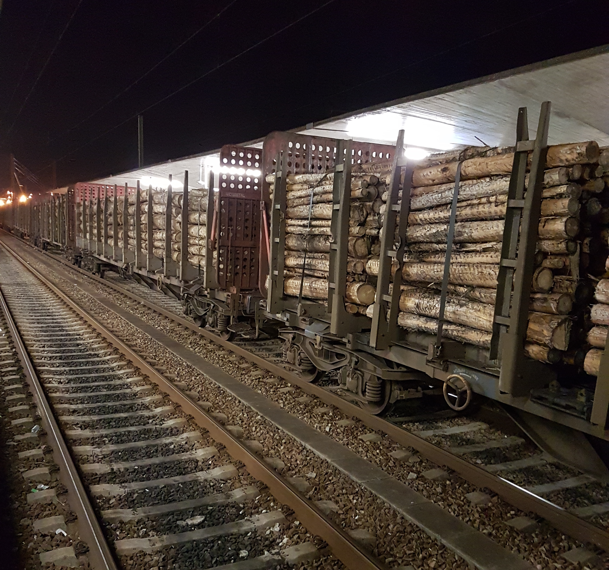

# A feast for fire – the disaster ecology of the Eucalyptus tree and other heavy drinkers

_Eucalyptus globulus_ isn't native to Portugal. Neither are my mother Annemarie and my sister Laurelin. But, like everywhere, there are good immigrants and bad immigrants. Whereas my sister and mother—good immigrants!—are intent on transforming their Portuguese valley into something resembling paradise, the many _Eucalyptus_ immigrants on their property are bent on the exact opposite: to suck the hillsides dry and let it all burn!

And burn it did—_twice_ in 2017. Just as my mother and sister were <a href="/and-take-your-plants-with-you/">on the move with a trailer full of garden</a>, the first series of wildfires hit the news in The Netherlands. I wasn't immediately worried. My mother out law asked me: “Isn't that the area where your family is moving?” I shrugged it off, somehow unable to imagine them near the June 2017 inferno that ended up killing 66 people. 

Meanwhile, Laurelin and Annemarie were _very_ close to the fire. Despite the Portugese (and Spanish, and French, and Moroccan, and Italian) firefighters giving their all, the many wildfires had continued to spread and reached their Ponte de Pedran property soon after my family. In fact, they hadn't even moved into the house yet. They had to wait for the then current-occupants to leave. The sellers' move was delayed by a medical emergency (unrelated to the burning of wood, more related to the burning of cigarettes). So, Laurelin and Annemarie were sleeping in tents. (You know? Those easily-ignitable deathtraps.) All the while, the fire crept up closer, with nerve-wrecking, lecherous leaps.

On June 18, they fled. The smoke had gotten so bad that it choked out almost all the light. My mother wrote:

> _De lucht is net zo oranje als de sinaasappels._

That was before their stuff had even arrived. (The movers were due a week later.) They waited out the fire at a camping where they previously made friends with the owners. The waiting was tense, because there was no knowing how far the fire would get and what would be left of their property. The death toll was already quite high by then and the damage done on the Iberian Peninsula (comprising Portugal and Spain) ran into the many millions. All they could do was hope that enough of the 3000 heroic <i lang="pt">bombeiros</i> and <i lang="pt">bombeiras</i> would be deployed to their soon-to-be-home valley.

<?project-insert?>

So why was so much of the Iberian Peninsula on fire (and would be again in October that same year)? Afterwards, when the blame stick was being passed around, numerous reasons were given for the June and October wildfires, but one reason really sticks out: piss-poor forestry planning.

## Thirsty trees

When the fire stopped raging, Annemarie and Laurelin returned to their new property to assess the damage: The main house was untouched. Even the tents were untouched. The fire was stopped just short of the tents. That's where the firefighters had stood fending off the fire. Heroes.

{.text-width width="3000" height="2400"}

The hillside above my mother's property <del>is</del> *was* covered almost completely with two tree species: <i lang="la">Pinus pinaster</i> and <i lang="la">Eucalpytus globulus</i>. These two species have one thing in common: they are thirsty.

{.narrow width="3024" height="2832"}

_Eucalyptus globulus_ is commonly called Tasmanian bluegum. Its native distribution was limited to what is now the Australian island state Tasmania and to the southern part of the mainland state above Tasmania: Victoria. The species has since been spread wider across the continent, and even across the oceans. _E. globulus_ its infection vector has been its usefulness to humans: mainly, _Eucalpytus_'s slender, smooth fibers can be turned into soft shitting paper (other paper too). In Portugal in particular, since the 1980s, many, many hectares of former forest and farmland have been planted with Eucalyptus plantations to supply the paper industry with fiber.

<table class="text-width">
<thead>
<tr>
<th style="text-align: left;" colspan="2">Area (as of 2005)</th>
<th style="text-align: left;">Origin</th>
<th style="text-align: left;" colspan="2">Tree species</th>
<th style="text-align: left;">Water use (kg day¯¹)</th>
</tr>
</thead>
<tbody>
<tr>
<td>885019 ha</td>
<td>27%</td>
<td>native</td>
<td><i lang="la">Pinus pinaster</i></td>
<td>maritime pine</td>
<td style="text-align: right;">125</td>
</tr>
<tr>
<td>739515 ha</td>
<td>23%</td>
<td>non-native</td>
<td><i lang="la">Eucalyptus globulus</i></td>
<td>Tasmanian bluegum</td>
<td style="text-align: right;">37</td>
</tr>
<tr>
<td>715922 ha</td>
<td>23%</td>
<td>native</td>
<td><i lang="la">Quercus suber</i></td>
<td>cork oak</td>
<td style="text-align: right;">10</td>
</tr>
<tr>
<td>150020 ha</td>
<td>5%</td>
<td>native</td>
<td><i lang="la">Querces</i> sp. (e.g. <i>robur</i>)</td>
<td>common oak</td>
<td style="text-align: right;">10</td>
</tr>
</tbody>
<caption>Adapted from: ⑴ <cite>A review of whole-plant water use studies in trees</cite> (1998) by Stan D. Wullschleger, F.C. Meinzer and R.A. Vertessy; ⑵ <cite>The Portugese Forest</cite> (2005) by Museu Nacional De História Natural e Da Ciéncia.</caption>
</table>

## De- and reforestation

Before Portugese agriculture was industrialized by the green revolution, the country side was a patchwork of forests, fields, orchards, and small meadows. With agricultural production intensifying in areas accessible by increasingly larger mechanical implements, the narrow terraces on steep hillsides were gradually abandoned. Generations went and left the idylle (and poverty) for work on factory farms, in actual factories, and—nowadays—in cubicles. Neglected fields and [orchards overgrown with bramble and ivy](/olive-yard/) where 

[Something about worsened drought], “it has also been shown [by Roger del Moral and Cornelius H. Muller, in <cite>Fog drip: a mechanism of toxin transport
from Eucalyptus globulus</cite> (1969)] that the leaves of the tree produce water-soluble phytotoxins that can prevent radicle growth of many herbaceous plants.” [<cite>Silvics of North America – Volume 2, Hardwoods</cite> (1990), [p. 300](https://books.google.nl/books?hl=en&lr=&id=bMnRqCA3uzwC&oi=fnd&pg=PA300&dq=eucalyptus+globulus+root+cooperation&ots=Jhdpp2fgnp&sig=4Hy2Q9qhvoHzU23WG8_PQJPkkB8#v=onepage&q&f=false)]

P. pinaster was used as a native species to afforest dune sands and degraded lands that may not have supported native forest. (Brimble 1948; Den Ouden & Boom 1965).

Cluster pine geographical history: https://books.google.nl/books?id=YawYOzQmcHEC&pg=PA120&lpg=PA120&dq=Charcoal+analysis+and+the+history+of+Pinus+pinaster+(cluster+pine)+in+Portugal&source=bl&ots=SIhbrlZvKz&sig=zmVeWInFl5BYHxdPvadgjQX0ZeM&hl=en&sa=X&ved=0ahUKEwib1aqD6_DaAhXLjiwKHfF7C10Q6AEITTAG#v=onepage&q=Charcoal%20analysis%20and%20the%20history%20of%20Pinus%20pinaster%20(cluster%20pine)%20in%20Portugal&f=false

Water repellancy: https://books.google.nl/books?id=Cf6dmFb6FW0C&pg=PA218&lpg=PA218&dq=The+role+of+soil+moisture+in+controlling+water+repellency:+new+evidence+from+forest+soils+in+Portugal&source=bl&ots=f0c5rg1SLp&sig=2VRxG31XmchhK0IYoDKKI5ZUAAc&hl=en&sa=X&ved=0ahUKEwi6o5Cr6fDaAhWNhKYKHYRHA4oQ6AEIUzAJ#v=onepage&q=The%20role%20of%20soil%20moisture%20in%20controlling%20water%20repellency%3A%20new%20evidence%20from%20forest%20soils%20in%20Portugal&f=false

https://www.sciencedirect.com/science/article/pii/0341816296000070

https://www.usgs.gov/science/mission-areas/water-resources/science/hydrologic-and-erosion-responses-burned-watersheds?qt-science_center_objects=3#qt-science_center_objects

## Baptism of fire

My mother's brother characterized their experience a “vuurdoop”. That's Dutch for a baptism of fire.
