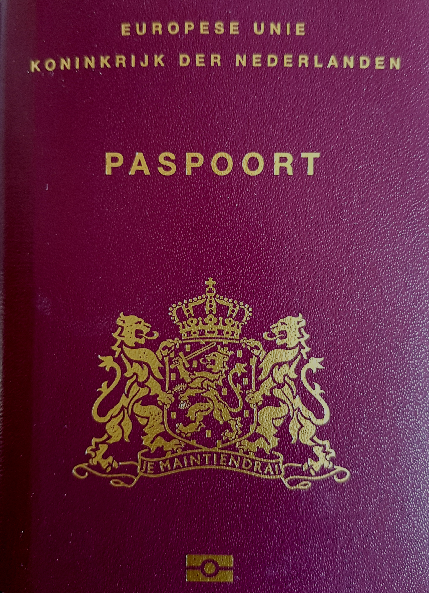

# And take your plants with you!

{.narrow width="2408" height="3328"}

My mother had been waiting for the right opportunity for over 30 years. And my sister had already left the Netherlands, some years ago, and vowed to never return. She even intended to rid herself of her most prized posession—her Dutch passport. Since she left for Ireland and then Scotland, she visited us left-behinds about once per year, apparently just to remind us that we, too, should someday pull our feet out of this once-swamp.

Having exchanged the lowlands for the highlands, Laurelin—my sister—didn't remain as enamoured with the Scottish weather as she was with the Scottish landscape. The climate in the highlands turned out to be even less agreeable than the Dutch climate—that clammy, swampy stuff that Annemarie—our mother—still wished to escape.

Annemarie (my mother) had long intended to leave the low lands and its damp, cold climate. But she didn't want to go alone, without family. And it was financially attractive to wait until she was older than 65. To me, her patience was maddening. As long as I can remember, she had hated The Netherlands. Never since returning from the year that she and my father spent in the Middle East after concluding their studies had she felt at home in the Netherlands. It had come to feel so drab and grey to her. So why was she still here?

[Middle east]

[Norg rijtjeshuis]

They had _almost_ emigrated, her and my father. I was in her womb while they explored New Zealand as a place to raise us. But, my father's world-saving ambitions got in the way. He could get a (temporary) research position at the University of Groningen. And I was born to grow up in The Netherlands.

[Annemarie in nieiw zeeland]

Yet, my mother divorced my father 15 years after that, and that split up is 20 years ago now. Even my youngest sister has long ago grown into an adult size, so why was my mother still here, growing older somewhere where she didn't want to be? Some of us were growing impatient to see her leave. But, like I said: it was a bit too grand of an adventure to go at it alone, especially for lady of respectable age with five grandchildren.

In the meantime, my sister Laurelin had been living in Schotland for so long that the spectacular Scottish landscape no longer compensated for a climate that is even more dreadful than the Dutch climate.

{.text-width width="3456" height="1944"}

So, they moved; they did. They took their belongings, asked a hauling company to load it into a large trailer, and drove to Portugal---to their new property---to wait for the movers to shuttle their stuff from storage, van by van. (Their large truck wouldn't be able to reach their remote property.)

The day before their departure, we were helping them with a curious task: to load their own trailer. Now, I know that loading trailers is not an exceptional thing to do when you're moving. What _was _ exceptional is what we were loading it with:

{.semi-text-width width="1200" height="1600"}

{.semi-text-width width="1200" height="1600"}

The trailer was loaded with my mother's garden. They would drive [km] km with a garden behind the car. 

After 8 days of driving and recharging, they arrived at Ponte de Pedro (on June 8) with most of their plants mostly intact. The plants could soon settle in their new home. Their owners, however… They would have to wait a bit before settling. But, more about that later.

{.text-width width="4592" height="2584"}
