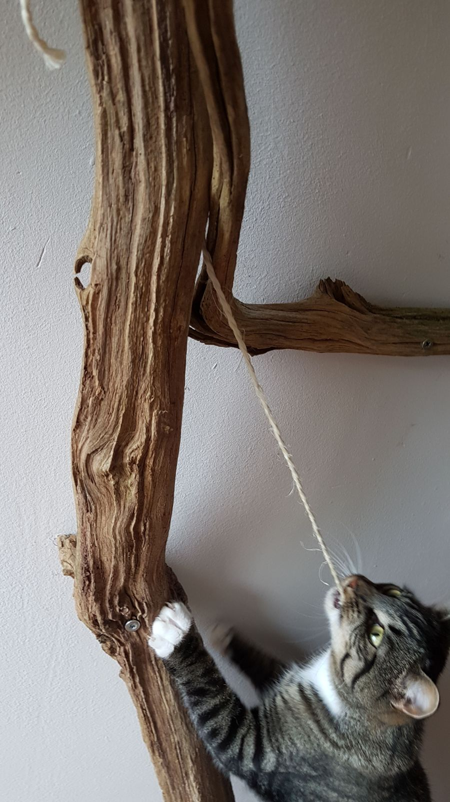

# Convict conditioning for cats

Our cats are felons. We don't trust them to conduct themselves properly outside the premises of our flat apartment. Therefore, we keep them locked up at all times. And, besides a few short escapades that ended with scaredly scurrying back up the stair well, they seem to have resigned to their indoors existence. Yet, their intense staring (and tail-wagging) at birds at the other side of the window reminds us that they are not, by nature, indoor creatures.

{.semi-text-width width="2068" height="3074"}

## Exercising the beast

{.narrow width="4032" height="3024"}

I can think of 3 ways in which the indoor cat's inner beast can get frustrated: ❶ when its hunter-killer instinct is frustrated; ❷ when there are no grassy leafs to get that slimy hairball out their stomach and onto our bed sheets; or ❸ if it can't scratch, climb, and recline in trees.

{.narrow width="1344" height="760"}

Cats are asocial creatures in the wild, where they live in family groups sometimes, but never hunt together. I have known domestic cats—a bunch that used to live with my mother—to gang up on other cats; so there _is_ that so-recognizable tribal element to them. Dinkie and Knabbel are not from the same nest; Knabbel is a few months older, but from the moment Dinkie joined our family group, they've functioned as siblings. Even now, at 3+ years old, they insist on running after each other like maniacs and play-fighting regardless of whether the other is actually play-fighting back or … just fighting, because he or she is annoyed with the aggressive insistence of the other. You can debate the overal intelligence of cats, and we suspect Dinkie to be significantly smarter than Knabbel, but you cannot debate their _social_ intelligence; there's just nothing there to debate; their clear disregard for each other's intentions is too absolute to be explained away by their egotistic psychopathy.

Knabbel and Dinkie are thoroughly domesticated; their infantile behaviours have persisted into adulthood, making them great companions also for us humans, with their regular begging for attention and overal cuddly demeanors. Their intra- and inter-species social behaviour is so un-wild-like that I wouldn't rate is as necessary to keep their inner wild cat from growing frustrated; but let me number it ⓿, because they do _appear_ to cherish all the attention from us and from each other.

{.semi-text-width width="4128" height="2322"}

{.semi-text-width width="4032" height="3024"}

We don't want Knabbel or Dinkie to end up bored, fat and lazy (in that order). We've had mixed success with our various counter-measures.

### Hunters and killers ☐{#hunter-killers}

For all their cuddly exterior (and their purring, and their cute, little head bunts), what cats like to do most is to cuddle a crunchy little bird to death between their cute cat teeth. Cats can be cute to their owners, but they are horrible in the way that they torture their prey before finally granting them the mercy of the kill.

But not our cats. They only get to torture the occasional spider or insect, which they then take their sweet time for. We've come to know the macabre meaning of both Dinkie and Knabbel looking with fascination at the same spot on the floor: something is struggling for its life. The horrible truth? We find this _cute_. These murderous machines make us make baby sounds.

Regarding the joy they'd take in hunting and killing, there's little that we can do to help them experience this in our home. After toying with the idea for a year or two and just getting raised eyebrows, last year I did finally end up loosing some baby frogs in the bathroom, and locking them in there with Dinkie. That was a mistake. One of the frogs was stressed to death. The other was slightly damaged and in pretty bad shock. Dinkie ate neither. As soon as their desperate hopping became less enthusiastic, he lost interest. The whole scene made me feel horrible, and I set free the surviving frog next to a nearby ditch, hoping that it would miraculously survive and mix with the local frog population. (We took the frogs from 10 km south of the city.)

After having resigned to the fact that we cannot match our cats on The Hare Psychopathy Scale, the closest we let them get to murdering prey is playing with little balls, wires and what not to let them at least practice their attack. Dinkie used to likes to play fetch the victim with a little ball. These days he prefers that _I_ run after the ball, while he shuffles around in the middle, trying out different angles for his ambush; then when I throw, he jumps as high as possible to grab the ball out of the air. Disemboweling stuffed toys (or, even better, bundles of socks) is ranked higher as a pastime for Knabbel. They both get equally lit up when the laser dot is activated, each in their own way:

* Tap-dancing with his front paws best describes what Dinkie does when you move the laser dot back and forth in front of him. That, or sprints, intertwined with stalking the dot from behind ridiculously bad camouflage.
* Knabbel also stalks and sprints after the laser dot. Additionally, she likes to jump over things that are between her and her prey.

### Grass eaters ☑{#grass-eaters}

<i lang="la">Felis catus</i> is an obligate carnivore, meaning that they don't digest plant material well. Why then do they insist on eating up so many of our precious house plants? Why, I ask you in particular, Dinkie?!

To keep Dinkie his greedy little mouth out of certain plants—especially seedlings—and his his proud little anus out of the nice, loose pot soil, we riddle the pots with skewers and upturned forks. This helps, to some extent.

{.text-width width="1600" height="866"}

### High climbers ☑{#high-climbers}

Cats like to climb. They feel safest in very high places. The wild ancestors of Knabbel and Dinkie spent a lot of their time in trees. There are trees growing in front of and in the back of our apartment. These trees even host birds.

{.text-width width="1300" height="900"}

dfdfd

sdsf

{.semi-text-width width="900" height="1600"}

{.semi-text-width width="4032" height="3024"}

<!-- TODO: Knabbel's almost-suicide -->

### Credits

Howard Bloom and his [story about the naked ocelot](https://youtu.be/8Z3uHFN7wPI) made clear for me the idea that there's an animal in each of our brains, and that that animal needs exercise in order to stay healthy.
