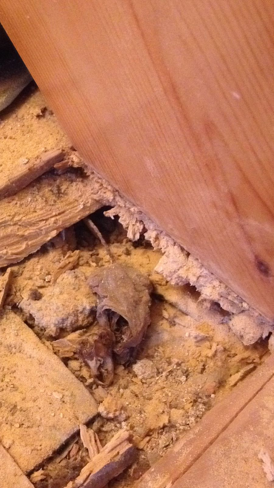

# Deceit or disinterest?

{.narrow width="900" height="1600"}

The floors weren't teeming with wood worm. Neither were the door frames, or the doors. The sceptic tank was a modern one of the double type from which almost clean water flowed, certainly not a plain, old tank with a mystery overflow. The wood stove was sufficient to warm the entire house, and it worked just fine, as did did the chimney (despite the 90° angle in the pipe). The toilet would flush turds, not be a turd. The sink worked and wasn't designed to expose the odorous world of the piping system. Nothing about rain that freely entered through the windows, the doorsteps and the chimney. The roof was water-tight. Oh, and it never freezes here during the winter, so you can grow pretty much whatever you want.

Were these conscious lies—misinformation by their agent? Or was the long list of omitted and incorrect information a symptom of the former owners' disengaged lifestyle? (All the pet piss and puke in the floor board cracks certainly was.)

Perhaps, an adventure in Portugal is supposed to begin with disappointment. Isn't that how all such stories begin? (Isn't that, in fact, how _all_ good stories begin?) At least, the house really did become Annemarie's after signing the paperwork, unlike in some of those stories were it turns out that the seller doesn't own the house. There were even a few surprise ruins that were not part of the sales pitch. But, then there was also the big 200 m² ruin that, yes, you would definitely be permitted to rebuild. (Not a word about the environmental protections that are in place to discourage building directly adjacent to natural waterways.) No matter that Laurelin's and Nils' plans with that ruin were central to the buy decision.

<?project-insert?>

## Carelessness taken to the extreme is recklessness.

The amount of deceit involved in the buying/selling game can be disputed. There was, however, quite definitely a minimum amount of carelessness involved. And too much of that can be dangerous, like when the only reason that you're not driven out of your house by the smell of pet piss and puke is because you're litting each next cigarette with the last.

### Exhibit A: who cares about electricity?

When you have trees on your property that start to overhang the utility wires, you might want to get rid of them. Or, you can just go back inside, light another one, and it leave it for the next owner to deal with.

{.semi-text-width}

{.semi-text-width}

### Exhibit B: Wim Hof in the house

Apparently, the previous habitants were students of Wim Hof—also known as the Iceman due to his extreme cold adaptation. Otherwise, why would they have stated that the single wood stove in the living room was sufficient to warm the whole house? While the thing's chimney was so crooked that you couldn't turn it on unless your lungs were already asfalted.

### Exhibit C–_n_: et cetera
