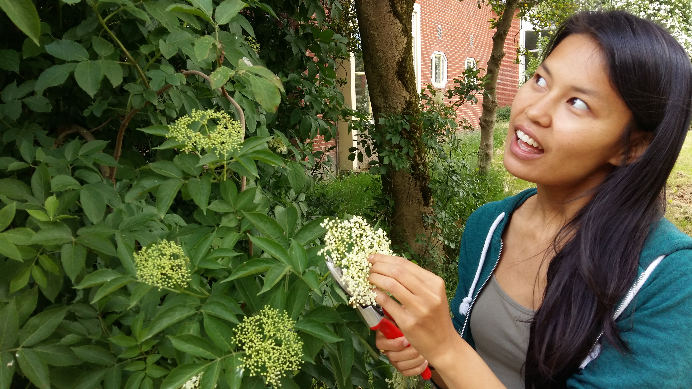
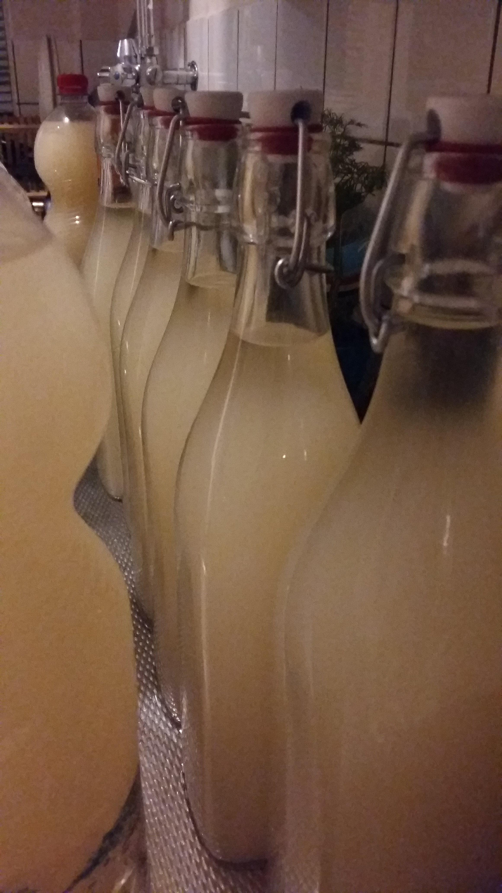
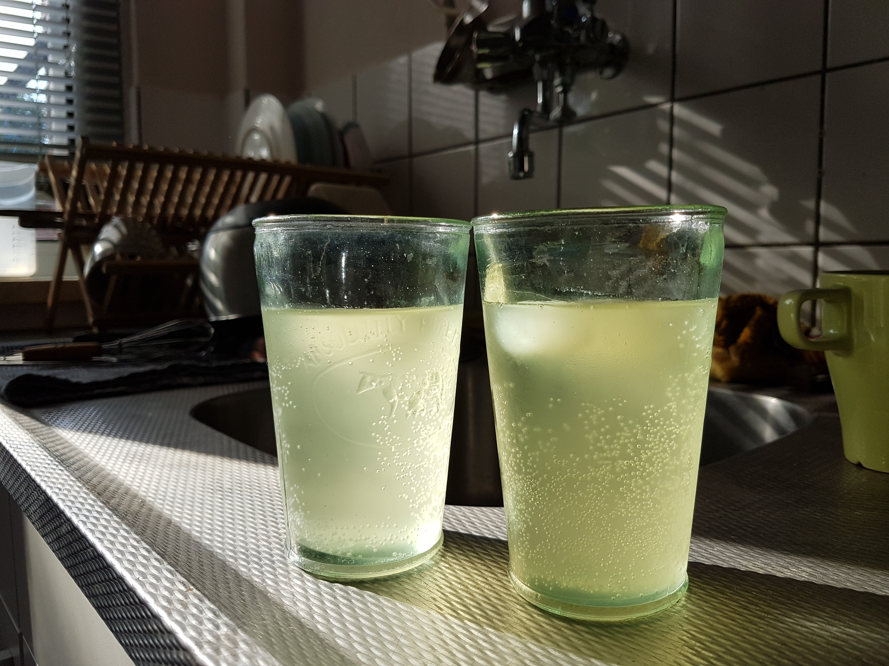
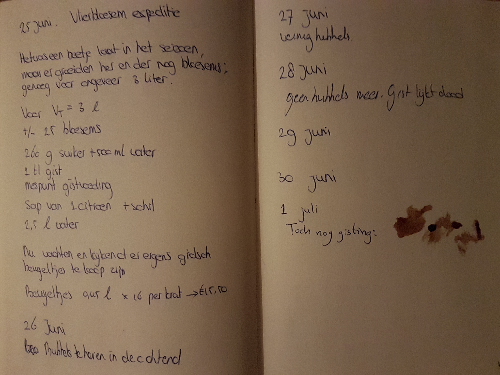

# Elderflower bubbles

_[Sambucus nigra]{lang="la"}_ is its scientific name, but I'm more familiar with its dutch name: ‘[vlierbes]{lang="nl"}’. The common name in English for this scrub is elderberry, but we weren't interested in the berries; we were interested in the flowers. So, we went on a little undertaking to a derelict school nearby that was swimming in a sea of white elderflower heads somewhere around the beginning of June.

{.text-width width="4128" height="2322"}

Having plundered a few plastic shopping bags full of flowers, time came to:

* shake the flowerheads a bit to coax the insects out;
* put them in a nice brew of
    * about 1.7 kg of sugar,
    * a bag (7g) of dried baker's yeast,
    * 2 teaspoons of yeast feed,
    * a few handfulls of cardamom seeds,
    * some lemon juice—we couldn't acquire whole lemons at that time and day—and
    * at least 15 L of water;
* close the fermentation barrel; and
* wait for the water lock to start bubbling.

{.semi-text-width width="4128" height="2322"}

{.semi-text-width width="540" height="928"}

A lot of carbon-dioxide passed through the water lock. When, after a few days, the baker's yeast stopped noisily pushing CO₂ bubbles through the water lock, we deemed it safe to put our elderflower _[sprudelwasser]{lang="de"}_ into bottles.

{.narrow width="2322" height="4128"}

It wasn't. One of our newly-acquired glass liter bottles from the Xenox exploded. Then, a repurposed wine bottle. After that, a PET bottle dumped most of its content in my face as I was _very_ carefully trying to let some of the built-up CO₂ escape. We had to keep depressurizing the bottles, while they kept blowing up left and right. Until, suddenly, the last bottle went flat, and the fun was over.

The mixture I had made years prior with my then-housemate Sanne had also been quite explosive. He had then been the lucky one whose ceiling was sprayed by angrily drunk, carbon-dioxide-burping yeast cells.

The taste of the mixture me and Sanne made was very different from the taste of Marilisa's and mine _spruddelwasser_. Marilisa and I threw so much flower heads into the bucket that it acquired a very rich—almost dense—flowery taste. You can even see this in the picture of the just bottled beverage: only part of the neck of the front bottle is clear; the rest is opaque. Later, as the flowery particles would precipitate, the liquid would become clearer.

The taste I remembered from Sanne's and mine mixture was a bit more prosecco-like—lighter. Overall, this year's (first) batch was the winner: it was sprinkly, bubbly flowers all the way to the bottom of each glass. 

{.text-width width="4032" height="3024"}

## Experiment 2

Marilisa followed our first, informal experiment immediately with a second, more formal, experiment, which had a much lighter taste, partially because, on June 25, 20 days after our first excursion, we had to scout far and wide for the final _[Sambucus nigra]{lang="la"}_ flowers of the season.

Initially, we thought that the yeast had already suffocated in its own exhausts. When we poured the result of experiment two into bottles, it had gone completely flat, devoid of that delicious CO₂. Yet, as evidenced by the last entry in the ‘lab’ journal, some cells in those bottles were still very alive:

{.text-width width="4032" height="3024"}

