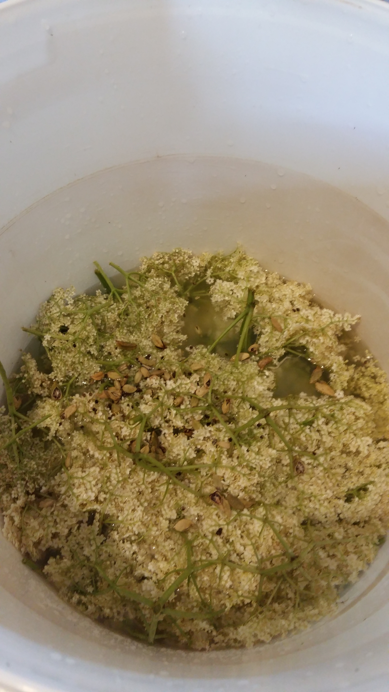
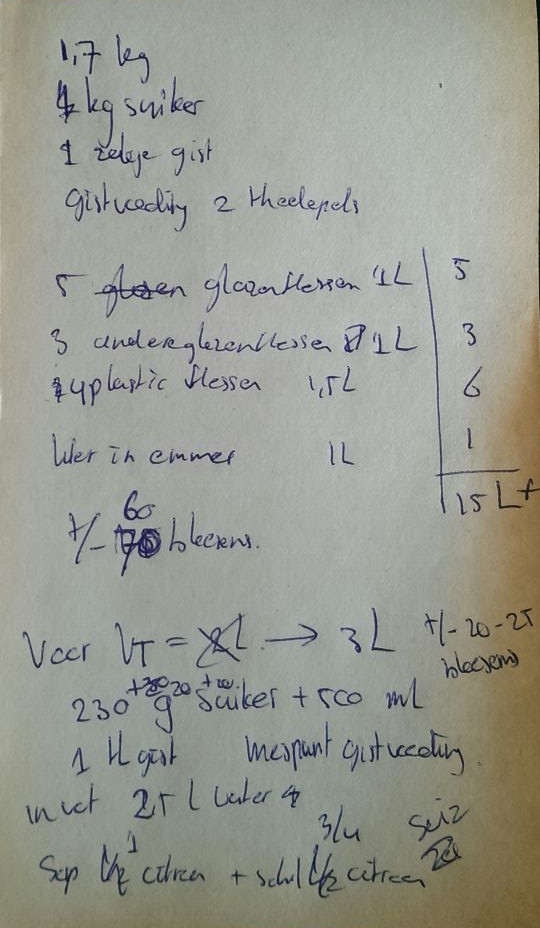

_[Sambucus nigra]{lang="la"}_ is its scientific name, but I'm more familiar with its dutch name: ‘[vlierbes]{lang="nl"}’. The common name in English for this scrub is elderberry, but we weren't interested in the berries; we were interested by the flowers. So, we went on a little undertaking to a derelict school nearby that was swimming in a sea of white elderflower heads a few weeks ago.

{.text-width width="4128" height="2322"}

Having plundered a few plastic shopping bags full of flowers, time came to:

* shake the flowerheads a bit to coax the insects out;
* put them in a nice brew of
    * about ;
* close the fermentation barrel; and
* wait for the water lock to start bubbling.

{.semi-text-width width="4128" height="2322"}

{.semi-text-width width="540" height="928"}

dfdf
