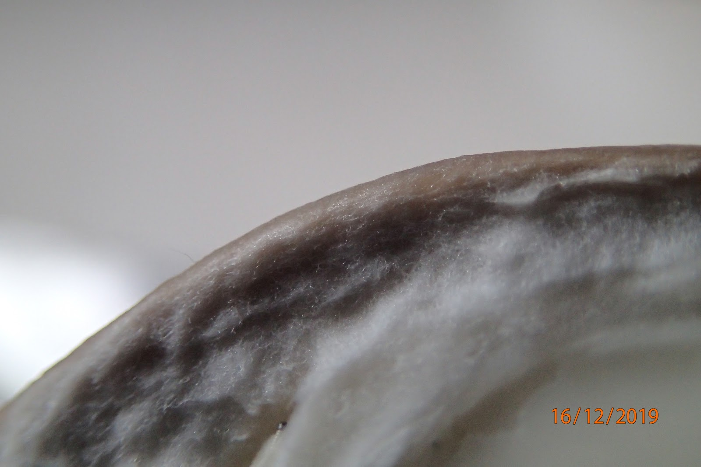
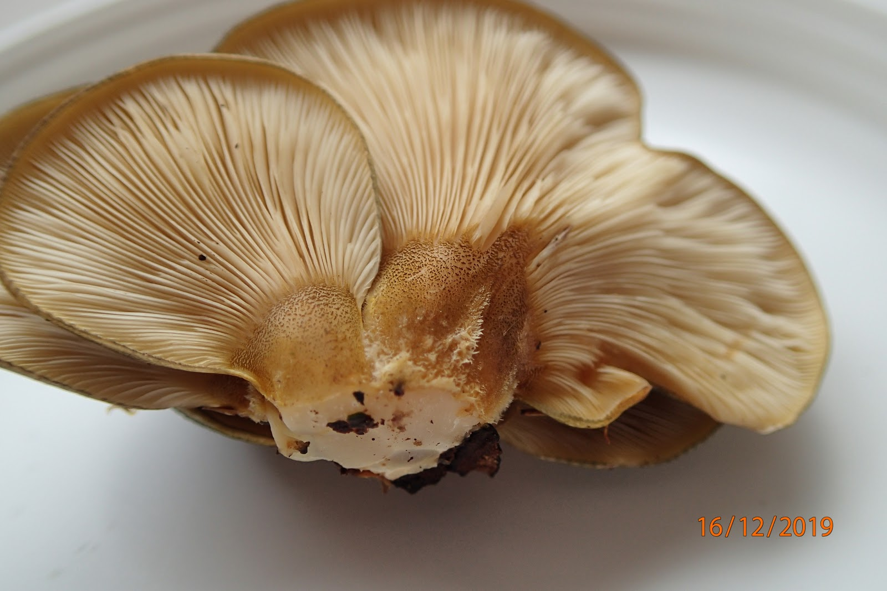
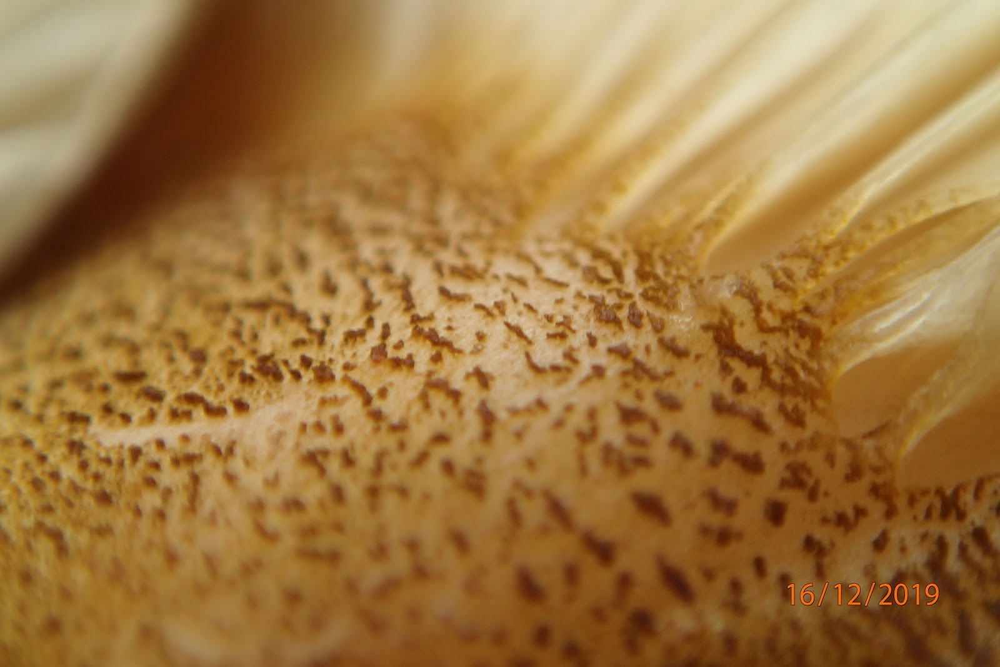
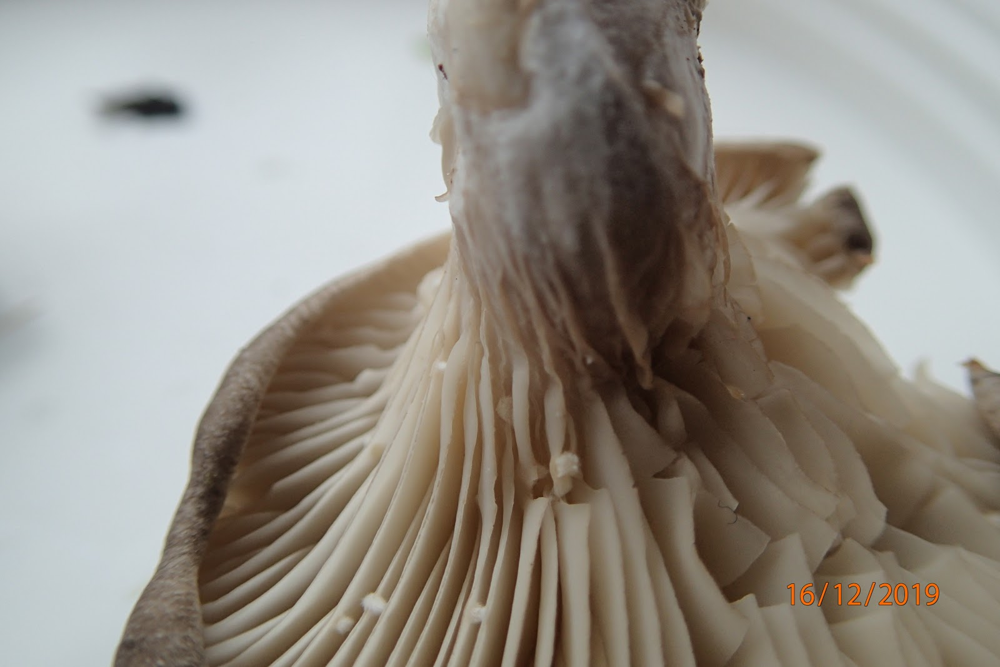

Dit is een korte gastgijdrage van Marilisa, geschreven nadat we in december 2019 heel optimistisch een hap namen van wat een oneetbare ragou bleek te zijn. De dader: <i lang="la">Panellus serotinus</i>, ofwel de groene schelpzwam. Gek genoeg schijnen ze hem in Japan heerlijk te vinden. Daar noemen ze hem <i lang="ja">mukitake</i>. Doe mij/ons maar gewoon oesterzwam (<i lang="la">Pleurotus ostreatus</i>)!

# De oesterzwam die geen oesterzwam bleek

Wees gerust, dit is geen verhaal over een tiendaagse paddenstoelenvergiftiging waarvan je eerst dacht dat het een licht griepje was maar plots omslaat in meervoudig orgaanfalen. Dit scenario ging heel even door mij heen toen ik een exemplaar uit de pan viste en proefde dat er een bittere smaak aan dit zwammetje zat.

Laat dit meteen een waarschuwing zijn. Paddenstoelvergiftiging is geen grap: je komt er goed vanaf als je je even niet lekker voelt. Ook al zijn de meeste paddenstoelen in Nederland niet erg giftig, er zitten een paar gemene bij zoals de groene knolamaniet.

Mijn oesterzwammenragout bleek geïnfiltreerd te zijn met groene schelpzwammen—okay, het waren allemaal schelpzwammen—de niet-giftige imitator van de oesterzwam. Laat smaak nou de slechtste eigenschap zijn waarop je een paddenstoel kunt determineren. ‘Hmm ik voel een lichte tinteling op de tong…’

De beste manier om deze twee uit elkaar te houden is door te controleren of de hoed bedekt is met een gelatineuze slijmlaag.

{.text-width width="1600" height="1068"}

{.text-width width="1600" height="1068"}

{.text-width width="1600" height="1068"}

{.text-width width="1600" height="1068"}

{.text-width width="1600" height="1068"}

Al met al was dit een leerzame ervaring en zijn we een paddenstoelervaring rijker.

Disclaimer: pluk nooit op eigen houtje zomaar paddenstoelen die je op wilt eten. Raadpleeg altijd een persoon die bekend is met de soort en die hier ervaring mee heeft.
