# Cretan herb farm

One hour from the town of Kavousi, there is a farm. Neither cows nor sheep are kept here, but herbs. All the herbs originate from the wild. The stems were cut and prepared for rooting in a nursery and placed back into the soil. Roughly seven years later, this plot of land has turned into herb heaven. Thyme, rosemary, oregano and many more are flourishing in their natural habitat. The herbs yield the highest amount of essential oils due to the optimal climate and minimal watering. So, I went there to live on this farm, doing some voluntary work for one whole month. 

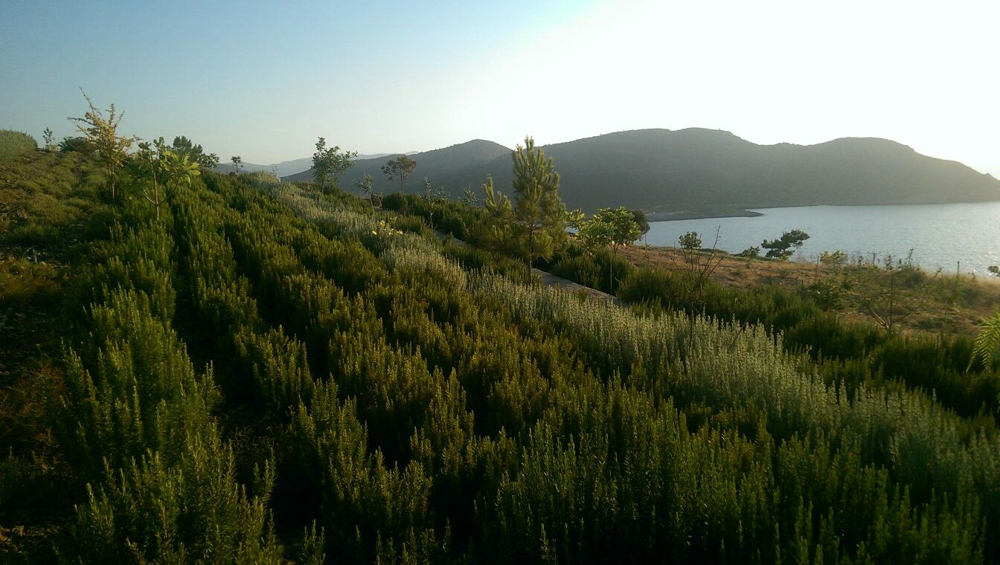{.text-width width="1344" height="760"}

## Crickets and swamps

I had fallen in love with the prospect of living in a giant herb pantry. The  work entails harvesting and watering. Just after six, Alice and André,  the only other volunteers, seem to decide it is time to do some farming. We are collecting some sort of Marjoram (_[Origanum microphyllum]{lang="la"}_). We cut the upward-growing stems and put the trimmings in plastic bags. The slope that we are on is covered with fragrant vegetation.

Out of curiosity, I ask what they have done before I got here. “Mostly we did some harvesting after 6 until we feel bored with the task and we manually watered some trees." Well, at least I will not get tired from too much labour. Maybe this will be more of a holiday than I expected it to be.

I leave the cooking to them after having chopped some zucchinis. The kitchen can maximally bear two people of average posture. In the meantime, I seat myself in the living area. The view from this place is a true delight. This is the kind of view that really makes you want to open your eyes; it's all soft and vibrant. However, my ears are suffering. There are crickets simultaneously screaming in my ear. It's like each tree has a cricket captain who gives the order to all the other crickets to start screaming. If I had known what they were screaming for I would have given them that. 

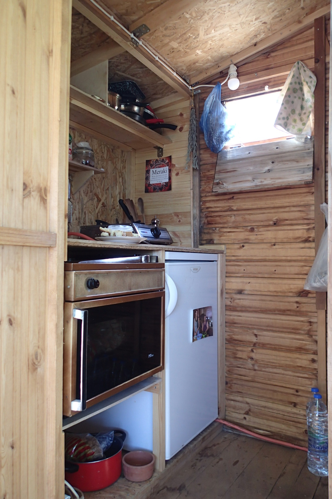{.semi-text-width width="1280" height="1920"}

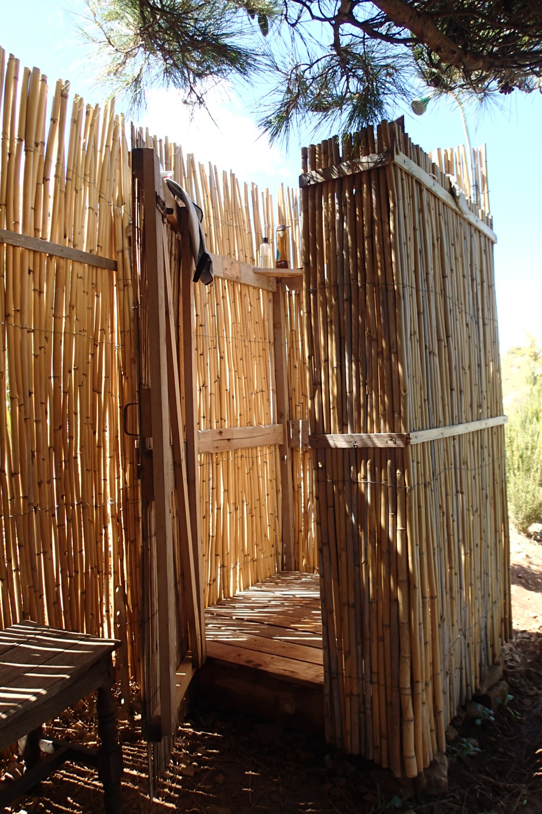{.semi-text-width width="1280" height="1920"}

When diner is ready, we seat ourselves at ‘the bar’. I am looking at the vegetable garden a few terraces lower. “We accidentally ate a baby pumpkin, thought it were a zucchini since it was green,” says Alice. “Maybe you can start a baby pumpkin farm,” I replied. “Tasted better than a zucchini though.” We laughed. My two companions are college freshmen. She wants to become a professor in nutrition and he wants to become a doctor. They are no strangers to micropipetting and _[C. elegans]{lang="la"}_, I found out. 

The next few days were basically on repeat, just like the crickets and sleepless nights. Have you ever camped during summertime in warm climates on an air mattress? Don't do it. Do not even consider it. Unless you like waking up in your own swampy ecosystem. And why do air mattresses deflate every three hours even though they are perfectly intact? After each round of sleep—let's say 3 hours—I ended up on the floor wondering whether it would pay off to get up and pump my mattrass. Most of the time I _did_, in a very bad mood.

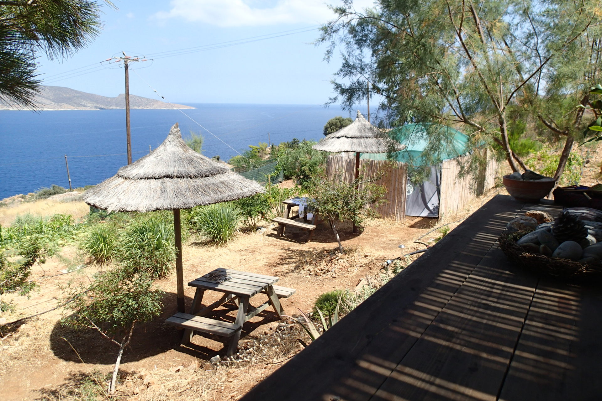{.text-width width="1920" height="1280"}

## Cast away

I had neighbours, a fridge with food, sanitary, public transport from an hour walk and a smartphone. So, cast away might be a bit of an exaggeration. But yeah, I was pretty much in solitary since the American couple left. So, I went to Agios Nikolaos to run some errands, the nearest real city within my reach. But before I got there I first had to go to the great small town of Kavousi (where the bus stops every 1–2–3 hours depending on the time of day). This time, the owners gave me a lift, since they were at the farm showing some people around. But otherwise, I walked 15 minutes to the beach, hitchhiked from there to the town and waited for the bus to the real city Agios Nikolaos. Going there was a venture on its own, I can tell.

The public transport on this island is quite okay, but the timetables are somewhat costumer-unfriendly: you are only provided with the departure time from the main station, so you have to make a rough estimation of each arrival. Together with my missing-transport-anxiety, I always ended up waiting for the bus in a cafe near the bus stop. In retrospect, I never saw the name of the cafe. I think “The Cafe” was the name. Anyway, it was a cafe that has 3–4 grandpas. They just sit there, seeing who is passing by and gossiping probably. 

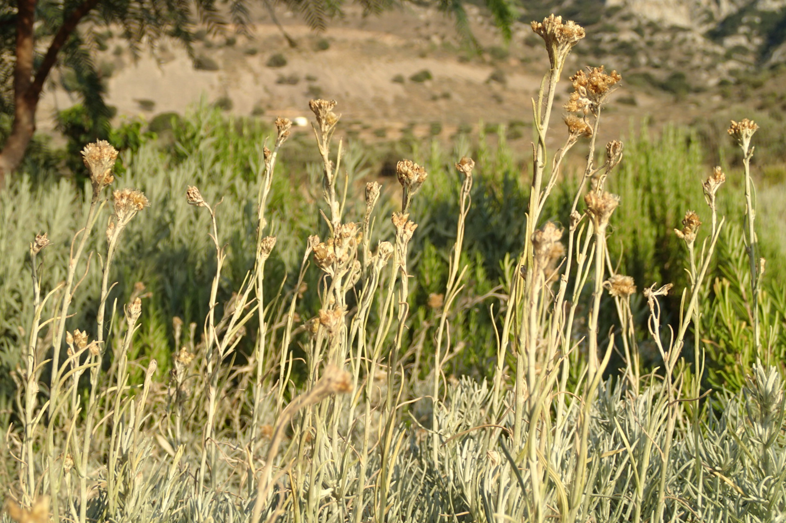{.text-width width="1920" height="1280"}

## Howling dogs don´t bite

Greek people do not treat animals well, specifically dogs, especially on the islands, I was told by my new companion on the farm. The first problem is stray dogs. Second, when people have dogs, they often mistreat them. My companion—Christina, usually lives in Athens, half Greek, half English—thinks most men here are macho men and childish. “Some of these people have never left the island and say there is no better place on the entire world than this.” I think this way of thinking is, ironically, not unique to this place. People from Amsterdam, New York or French people might say the same about their place. But in this case, I have to admit, it might be true. 

Compared to this island (and all the other Greek islands) the rest of the world appears as a demonic heritage. There is hardly any drugs, theft or mafia. On Crete are no refugees. Look at the houses: gnomes, goblins and gremlins (hobbits perhaps) could live here. The only evil on this island is childish macho men mistreating their dogs.

As it happened to be, evil was right across the farm. The owner of this plot of land, a macho childish man, collected (stole?) dogs and tied them to the olive trees. Christina was making fun of me when I noted he might want to protect the trees. “Well, trees can't run,” I said, causing her to even laugh harder. Not so surprisingly to me, it turned out he indeed wanted to guard his plot of land.

The dogs, 4 in total, were attached to the trees with a leash and were fed only once in a few days. It was Christina who found out about the dogs. (I thought it were some stray dogs howling in the night.) So she decided to bring them food and keep them some company. It turned out the dogs were anything but wild, as they were very happy with a human visiting them. Everyday she cooked them a pan full of pasta with cheese, eggs and sometimes leftovers. Alternally she also fed them potatoes and rice with vegetables. One funny note: the woman never cooked a meal for herself. The only human food she could really prepare was salad (chunks of cucumber and tomatoes). Anyhow, she couldn't bear the dogs being neglected by their owner. They weren't in a healthy state. After having done some research, she discovered the owner had been sued before for animal neglect.

Sadly, lucky for him, all the cases kind of died before a verdict was spoken. People in the surrounding area were protecting towards the owner like he was just a child. This phenomenon is very common in small places, I think. Everybody is somehow related to everybody in these places. (Do not think about it for too long.) Nobody wants to be known as the one who locked up “poor cousin generic Greek name”. But this time it is different. Christina would leave this place, had no real ties to this place. The moment she saw one of the dogs had died, she couldn't stop herself from going straight to the police. It was of importance this man would never be in possession of animals again. 

## I've got plenty of thyme

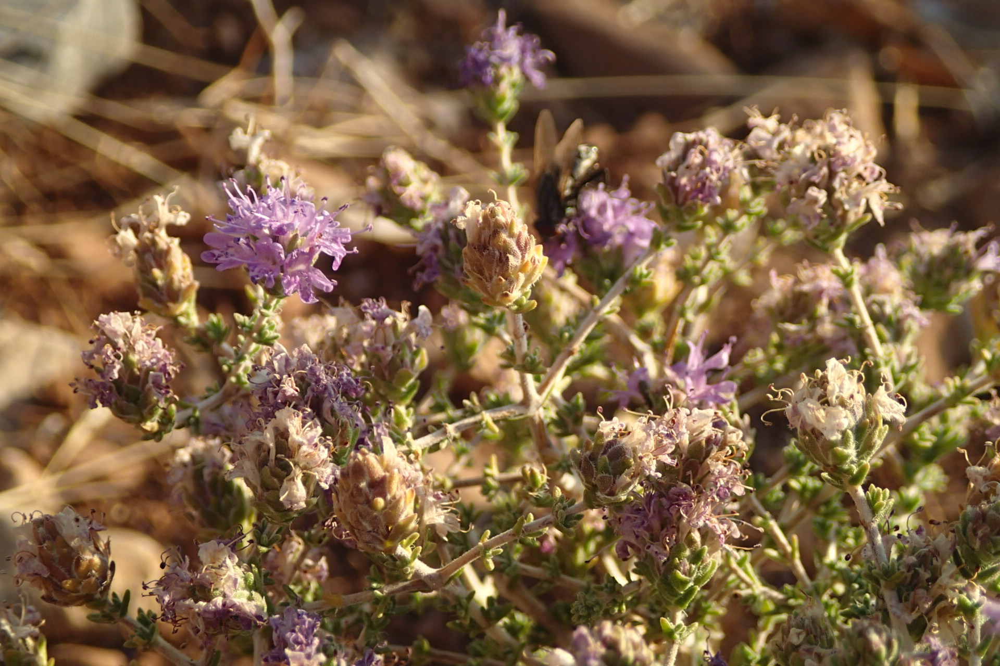{.text-width width="1920" height="1280"}

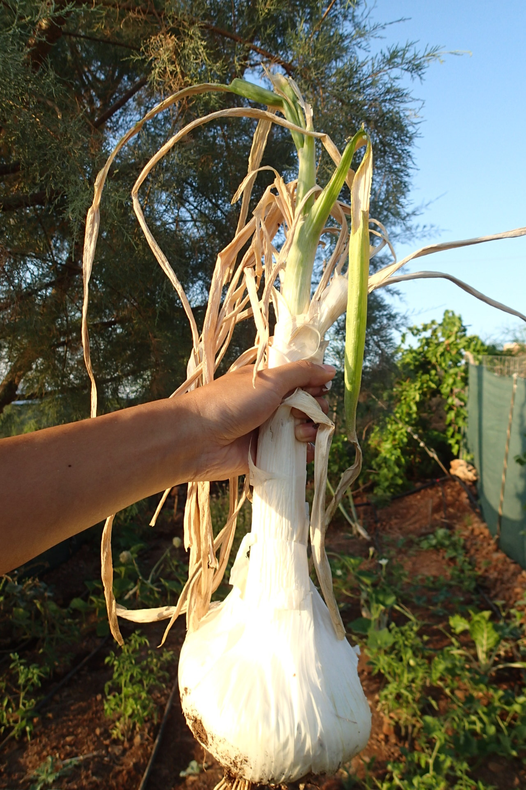{.semi-text-width width="1280" height="1920"}

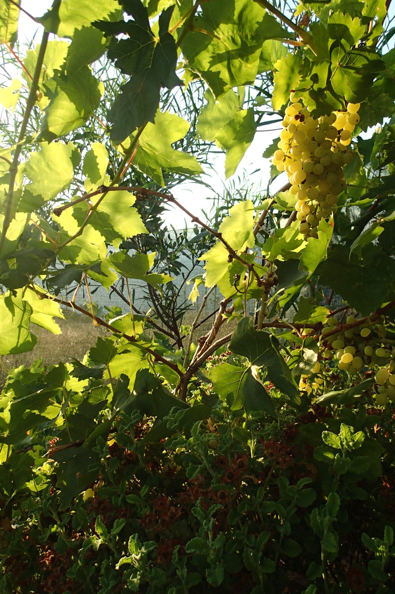{.semi-text-width width="1280" height="1920"}

In the afternoon I sit on one of the benches in the living area. I miss padded furniture, real bedding, and walls around my imaginary bed that stops the sun from chasing me away in the morning, especially because I gained a skin infection. The name is _[Impetigo vulgaris]{lang="la"}_. Yes, it feels just as annoying as the name sounds. It starts as normal-looking mosquito bites, red and itchy. But in fact, these are the places where the bacteria _[S. aureus]{lang="la"}_ has found its way into your epidermis. I have had this before, but not all over the place like this. All my scratches from the prickly bushes turned into this rash with blisters and crusts. From that moment onwards, I didn't do that much. The only thing I did was sitting and breathing. And I read some chapters from 'The Secret Life of Plants'. 

Sometimes, Vasilis, an Albanian worker, joined me in the activity of sitting and breathing during his break. We were unable to have a conversation. The only thing we could share were the melons he picked from the garden. 
  

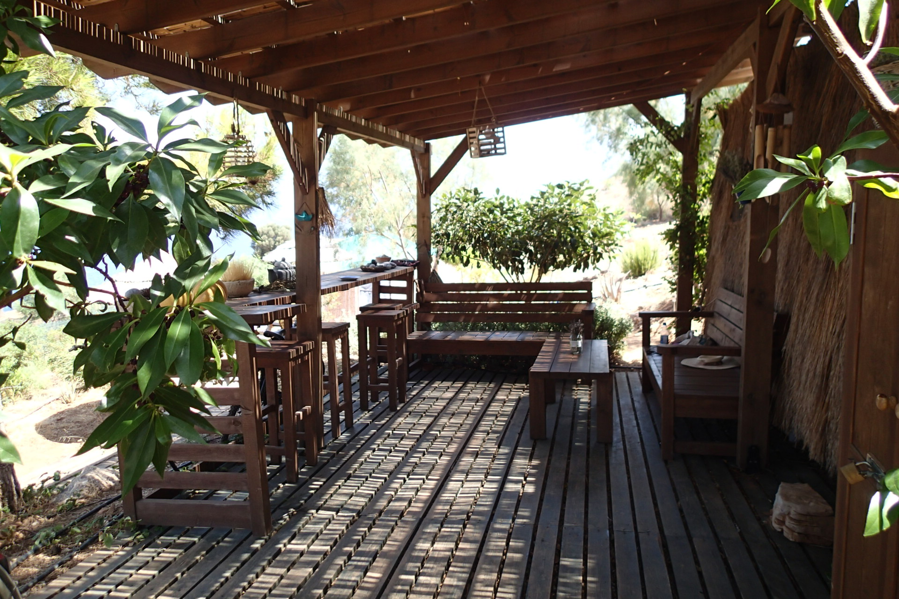{.text-width width="1920" height="1280"}

## _Afgaristo parakalo yasas_

I happen to have increased my Greek vocabulairy with a few words: three to be exact. I have been surrounded by Greek since I got here, which is not very remarkable as I am in Greece. It helps that I actually live on the farm with someone who is Greek-halve-English. She can talk to the people here. So, we decided to go to the only restaurant that is down on the route to the village of Kavousi. We jumped in the back of a pickup truck that stopped once they noticed us strolling. Hitchhiking came naturally to us: neither one of us had to raise a thumb.

We sat down at the patio, drank raki, ate meze, together with one of the owners ‘Yanis’, a middle aged man. He looks tired and stressed out. Later on, he tells tourist season starts to wear him out. The restaurant with appartments is a family business in the middle of an olive tree orchad (http://tholos-rooms.gr/). His mother made the lovely zucchini balls that are on the table. This place can not get any more Greek than this. 

By the time I finished one shot of Cretan raki, dear Yanis has had three for sure. And I could tell he did this every single evening. His eyes looked droopy and his belly pregnant. Raki is the national booze of Greece. It is their moonshine, made of leftovers from wine production: grape peels and a splash of grape juice. When the raki is ready to be consumed people go from town to town to get a first taste of the year (and a mother of hangovers, I assume). 

One plate of zucchini balls later, it was getting dark. Christina and I decided it was time for us to go back to the farm. Yanis kindly offered us to take us home. By the time we were nearly home I realised our designated driver was anything but sober. Christina told Yanis about the pickup truck. She translated for me: Yanis said that nobody would ever pick him up if he would try hitchhiking. 

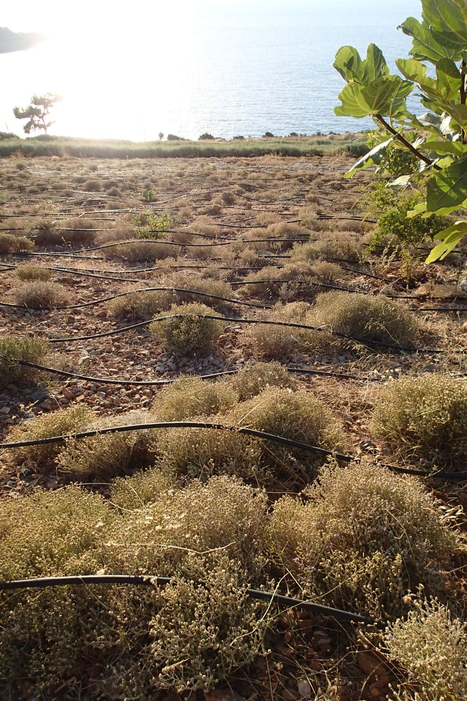{.semi-text-width width="1280" height="1920"}

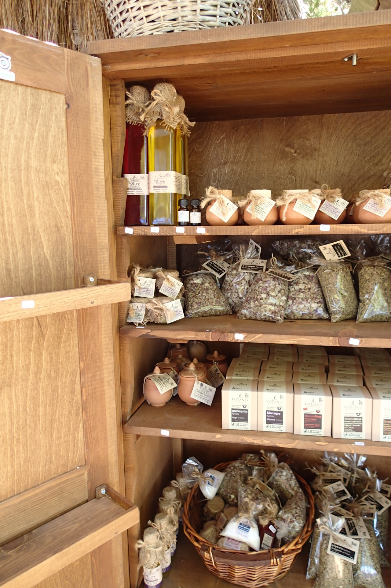{.semi-text-width width="1280" height="1920"}

I had plans. I had booked an appartment in the Town of Sitia for the last week to recover from my skin infection. But then, my grandmother died. 96. I was thinking to myself: “What am I doing here any longer?”. I realised it was time for me to go home.

After having ruined my gut microbiome with antibiotics, my rash finally started healing slowly. I am happy to sleep in my own bed again. I am happy I am within reach of my beloved ones. On one of the last days, I ate some figs from the trees. Did the fig trees know all along I would leave earlier? I had secretly encouraged them to ripen their fruits on time. All of a sudden they were.

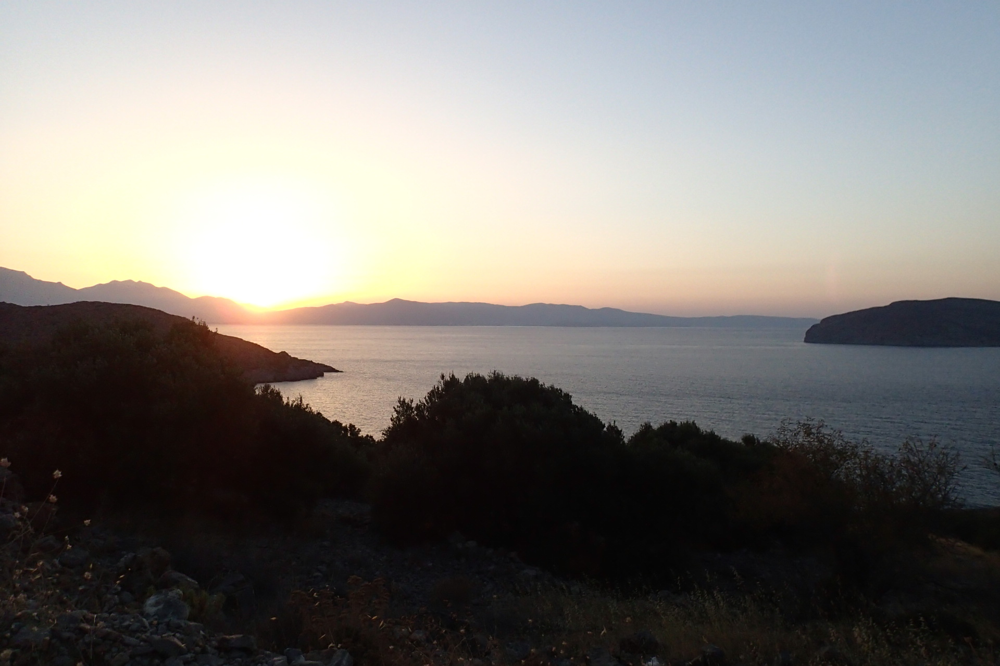{.text-width width="1920" height="1280"}

<?author-insert?>

Are you interested in the farm? Go to: [www.votania.com](http://www.votania.com/)
