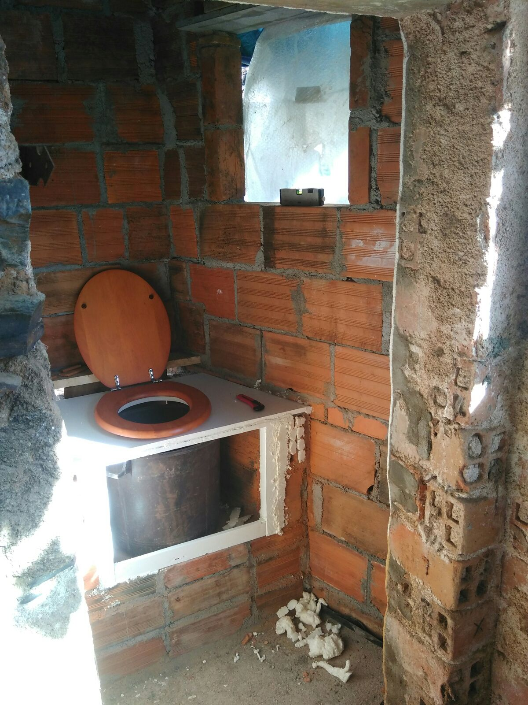

# Lau her humanure

Laurelin poops. She does so quite regularly, which is a sign of health. That must be why she thought it a waste to just throw all that hearty poop away, as if it wasn't worth a thing. Enter her homemade compost toilet, where all that treasure is collected, in a rather substantial bucket.

{.narrow width="1200" height="1600"}

A compost toilet is a natural signpost on her and Nils' journey of becoming full-fledged permaculture hippies. How else would they ever get close to closing the nutrient cycle? There's only so much shit you can do to keep your outputs from exceeding your inputs. If you keep flushing your outputs into the ocean, your soil won't thank you, and neither will this grumpy marine biologist; all that nitrogen shit can cause havoc downstream, and the algae will bloom.

## Soil safety

 compost is purposed for enriching the 

{.text-width width="4032" height="3024"}
