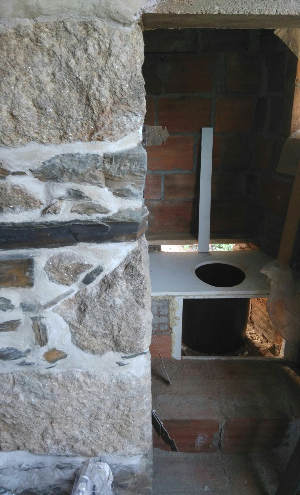

# Lau her humanure

Laurelin poops. She does so quite regularly, which is a sign of health. That must be why she thought it a waste to just throw all that hearty poop away, as if it wasn't worth a thing. Enter her homemade composting toilet, where all that treasure is collected, in a rather substantial bucket.

{.text-width width="4032" height="3024"}

A composting toilet is a natural signpost on her journey of becoming full-fledged permaculture hippies. How else would they ever get close to closing the nutrient cycle? There's only so much shit you can do to keep your outputs from exceeding your inputs. If you keep flushing your outputs into the ocean, your soil won't thank you, and neither will this grumpy marine biologist; all that nitrogen shit can cause havoc—like algal blooms—downstream.

<?project-insert?>

## Keep your nitrogen near

We live in nitrogen-flooded times, since the availability of cheap artifical fertilizers revolutionized agriculture around a half-century ago. One of the casualties of this revolution have been the quality of our surface water. Ground water quality has also been affected.

This is not their main concern. Their main house is connected to a sceptic tank, not to the sewer. And although it's a shit, old sceptic tank ([contrary to what they were told](/deceit-or-disinterest/) when Annemarie bought the property), that does mean that their outputs don't end up somewhere downstream.

But, I am ranting. They're not about to start using artificial fertilizers. Their main priority is keeping nutrients _in_ their system, not so much to keep these nutrients out of other systems.

{.semi-text-width width="972" height="1600"}

 in the main house was being replaced. And it does look neat with the smooth, wooden seat. All it really needed were some fresh feces and urine.](Ponte_de_Pedra_2017-11-20_Compost_toilet_finished.jpg){.semi-text-width width="1200" height="1600"}

## Shit safety

Some poop pathogens are a bit scary. Among the scarier critters are soil-transmitted helminths. Helminthiasis—worm infection—is largely confined to tropical regions, but that is hardly reassuring when [WWOOF](https://www.wwoof.pt/) delivers a dirty dreadlock hippie from Who Knows Which Shit Country at the doorstep.

Not as scary as the worms are the bacteria. Most strains of <i lang="la">Escherichia coli</i>—a particularly well-studied species—are harmless and a part of every healthy person's gut flora, although some strains are serious turd troublemakers. Dispite there only being relatively few pathogenic strains of <i lang="la">E. coli</i> (such as <i lang="la">E. coli</i> O157:H), its ubiquitousness in human feces and its popularity as a model organism in the life sciences makes it _the_ go-to indicator organism for fecal contamination of soils and surface waters. Thus, typically, an <i lang="la">E. coli</i> test will be employed to make sure that the dreaded dready hippie's worms don't end up in the salad.

<i lang="la">E. coli</i> tests are already cheap, and cheaper, simpler tests such as [_E. coli_ test strips](http://journals.plos.org/plosone/article?id=10.1371/journal.pone.0183234) are underway. Still, the hassle of testing the home-made humanure for contamination can be by-passed by being somewhat conscious about the composting process and application.

Process-wise, it should already be sufficiently clear that defecating directly in the lettuce bed is a bad idea. So, Laurelin collects the compost in an open compost pile, where the sawdust (that they apply between bowel movements) should provide for the aerobic growing conditions (40–60 °C  = 104–140 °F) needed by the thermophilic composting bacteria that oxidize the waste while generating temperatures high enough to kill even helminth eggs, the hardiest of all poop pathogens (brought by that dreadlock dude, remember?).

<table class="text-width">

<thead>
<tr>
<th colspan="2">Duration</th>
<th>Temperature</th>
<th>Source</th>
</tr>
</thead>

<tbody>

<tr>
<td style="text-align: right;">2</td>
<td style="text-align: left;">weeks</td>
<td style="text-align: right;">55 °C</td>
<td rowspan="2">Berger, W. (2011) <cite>[Technology review of composting toilets](http://www.susana.org/en/knowledge-hub/resources-and-publications/library/details/878) – Basic overview of composting toilets (with or without urine diversion)</cite> </td>
</tr>

<tr>
<td style="text-align: right;">1</td>
<td style="text-align: left;">week</td>
<td style="text-align: right;">60 °C</td>
</tr>

</tbody>

<tbody>

<tr>
<td style="text-align: right;">1</td>
<td style="text-align: left;">hour</td>
<td style="text-align: right;">62 °C</td>
<td rowspan="4">[Composting Chamber](http://ecompendium.sswm.info/sanitation-technologies/composting-chamber?group_code=s), in <cite>The Online Compendium of Sanitation Systems and Technologies</cite></td>
</tr>

<tr>
<td style="text-align: right;">1</td>
<td style="text-align: left;">day</td>
<td style="text-align: right;">50 °C</td>
</tr>

<tr>
<td style="text-align: right;">1</td>
<td style="text-align: left;">week</td>
<td style="text-align: right;">46 °C</td>
</tr>

<tr>
<td style="text-align: right;">1</td>
<td style="text-align: left;">month</td>
<td style="text-align: right;">43 °C</td>
</tr>

</tbody>

</table>

Because there's no unanimous agreement on the temperatures and durations needed to kill all shit scariness and because Laurelin doesn't feel like tracking the temperature of her humanure heap with a thermometer, even after composting for a year, she won't apply her humanure to the vegetable patches. Instead, the compost will be used to kickstart the many nut trees after they've been transplanted from the [tree nursery](/tree-nurse-nils/).

{.semi-text-width heigth="4032" width="3024"}

{.semi-text-width width="3024" height="4032"}

If all this got you excited to recycle you own poop and you want to learn more, there's an [article on composting toilets](https://en.wikipedia.org/wiki/Composting_toilet) on Wikipedia. And, if you want to go all official, there's even an [ISO standard 24521:2016](https://www.iso.org/standard/64679.html) in the making.
