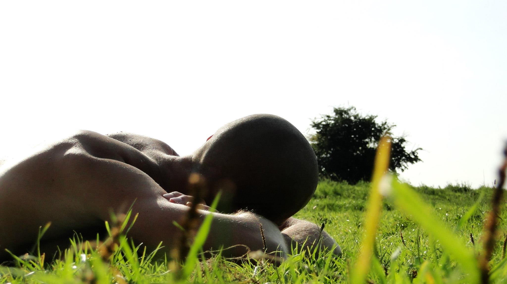

# Rowan and his microbial ecology thesis

I grew up in my parents’ wild gardens, as my mother grow up in her parents’ wild garden and my father partly in the lush garden around his parents’ [vacation home in the forests of Drenthe](/projects/de-schuilplaats). All my grandparents have since passed, but some of their legacy remains: the wild garden of my mother’s parents has outlasted them, because it was beatiful enough that, when my deceased grandfather’s house was finally sold, its new owners wanted to keep the garden; the forest vacation home—[De Schuilplaats](/projects/de-schuilplaats)—is still surrounded by a lush garden,
now maintained by me.

{.text-width width="2048" height="1152"}

After programming for 10+ years, in 2011 I got fed up with sitting inside all day, interspersed by the occassional garden project. Frustrated with my lack of scientific knowledge, I persued a bachelor in biology at Rijksuniversiteit Groningen, where I majored in ecology & evolution and marine biology. My [thesis ](Biol_BC_2015_RRvdMolen.pdf) discussed the effects of perennial polycultures on microbial markers of soil health. (In [permaculture](/scope/permaculture), perennial polycultures are a recurring [agroecological](/scope/agroecology) concept.)

<!-- FIXME: Make the PDF icon automatic -->

<!-- vim: set tabstop=2 shiftwidth=2 expandtab: -->
