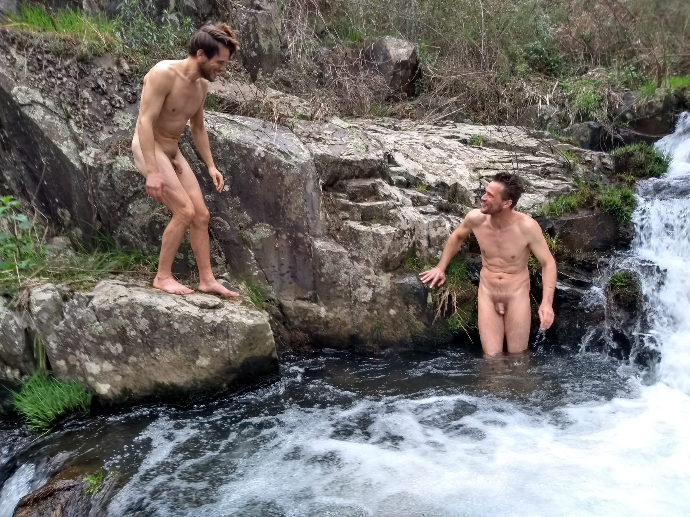

# The Ice Shaman and the rekindling of my inner fire

“The Ice Shaman.” I couldn't have come up with a better title for Wim Hof myself. Usually, Wim is dubbed The Ice Man, but Russell Brand's “The Ice Shaman” suits him so much better. Whichever interview or documentary he finds himself in, as soon as Wim starts coaching anyone in his signature breathing method or through an ice bath, he's more shaman than coach. He may even randomly start chanting, singing and playing the guitar. Some describe him as a force of nature. That may be pushing it. Rather, he is _aligned to_ the full force of nature, **and** his method can help me and you re-align too.

Unlike Russell, I never met Wim myself. But, without ever meeting, The Ice Shaman managed to rekindle my interest in the cold. He did that by sheer means of being _out there_, with his Wim Hof Method freely distributed through the Internet, via interviews, and in documentaries. His mission? Healthier, happier people. He may yap a lot about the “scientifically-proven” benefits of cold exposure and breath holding. And, especially for the health benefits of breath holding, there is some proof. But, I don't care. What I care about is that he wants people to trust that they are _strong_. I think the most important part of his method—of his unkempt energy—is that he makes people _believe_. He and his method remind us of something we've long forgotten—something that our parents' parents had for the most part already forgotten. He reminds us that we are _strong_, so strong that we can withstand the freezing cold … in nothing but our birth suit. To me, Wim is undoubtedly The Ice Shaman because he has fully mastered the placebo effect! And that's even better than the most cutting edge of modern medicine for most contemporary ailments. In this so-affluent corner of the world, the bulk of chronic disease is a variation on the same theme: we've become weak-willed creatures, tamed by a homeostasis that is ever too easy to acquire in cages that have become so luxurious that we no longer even need to get up to change the set point of the thermometer. “Hey Google…” “Hey Alexa…”

&#x1f525;

My personal tale of the cold starts _not_ [when I first started taking cold showers](#cold-showers). Chronology fits this story like the clothes you best discard before jumping in the ice-cold water. Instead, this story start quite close to the present, in February of this year (2020), when I visited my brother Jorrit at the [beautiful camping in the Dordogne region of France](https://www.termedastor.com/en/), where he lingers.

{.text-width width="4032" height="3024"}

The plan was that, vacation or not, I would carry on my discipline as I normally would (try): for at least 6 days per week, get up at 6ᴬᴹ; twice daily, exercise, thrice daily, meditate; and semi-daily, immerse myself in the cold. Jorrit had a slightly different routine. His morning ritual: make coffee, roll a cigarette, and sip coffee on the veranda while smoking hist cigarette, then rolling the next. His evening ritual: drink, and smoke on his veranda while drinking the opposite of coffee. But something—actually some<strong>one</strong>—a rather lively lady—had rekindled the desire in him to live his life consciously. That spark soon turned into a smouldering fire until he no longer wished to remain knocked unconscious by the various substances he had so long relied on to dull his pain. His cynicism was cracking under the pressure of love—a perfect time, he figured, to invite the wholesome influence of his disciplined little brother.

This o-so-disciplined little brother's daily routine did not survive the onslaught of the two volumes from Robert Jordan's <cite>Wheel Of Time</cite> series that he brought with him. The first morning at Terme d'Astor, instead of bouncing impatiently around my brother's bed at 6 sharp, I was struggling to haul my own grocky ass out of bed, to the coffee machine an hour later. And, after a few more nights of “just one more chapter”, I struggled to get out of bed even before noon. The coffee didn't help, although I depended on it to remain wobbling on my feet. Incidentally, coffee is the one drug that Jorrit didn't quit that week. [We both quit a couple of months later.](https://youtu.be/CT1NB7YRedk) Jorrit did quit drinking _and_ smoking, cold turkey. We worked out together. We talked. We talked some more. It had been years since I last visited him and even more years since I last visited him _alone_, for some bro time. And my bro was no longer the cynical ass he used to be. We had some catching up to do. And we meditated. But, most importantly, we faced the discomfort, pain and general unpleasantness of the cold … together.

Here's one part of the story where chronology matters: first, we started facing the cold together; then, Jorrit quit smoking and drinking. He did not quit as a direct result of cold immergence. It had everything to do with wanting to live and wanting a shot at love. And the cold? Helped.

## Blood brothers

When you've decided that you're going to plonge into ice-cold water, you're often not precisely looking forward to it. If _you_ have never taken a cold bath, then imagine: You're standing there. The sun has just gotten clouded over, or maybe you feel raindrops on your naked skin. Yes, you're naked, unprotected. It's winter. Not summer. Not spring. Winter.

{.semi-text-width width="1200" height="1600"}

{.semi-text-width width="1200" height="1600"}

You walk in. That was where we where lucky: Down the wildly forested <!-- TODO: insert link to article about how Jorrit keeps the hill sides at Terme d'Astor wild. --> slope of Terme d'Astor, there's an old loam pond that Jorrit deemed more suitable for our cold adventures than the slick swimming pool that is the camping's proud centerpiece. We could gradually walk into the loam, feet sacking slightly into the muddy, leafy top layer of the loam. Then, when the prickling of the cold in your skin got worse, we would first walk out again, giving our legs the opportunity to heat up and recover from the shock, before forcing them back in, along with everything above our legs. (Yes, that includes…)

{.semi-text-width width="1200" height="1600"}

{.semi-text-width width="1200" height="1600"}

And so, after postponing the inevitable encounter with the cold until a few days after my arrival, we finally got in. Our first joint encounter with the cold was squeamish. But we got in. And it was glorious.

<iframe id="icy-loam" title="If you have a problem with nudity, you're in the wrong place. This is a nudist camping. And we're naked apes. You are too, regardless of your attempts to cover up the truth of you nakedness." src="https://www.youtube.com/embed/qNRyN0NH49c?rel=0&amp;showinfo=0" frameborder="0" allow="accelerometer; autoplay; encrypted-media; gyroscope; picture-in-picture" allowfullscreen="1" data-aspect-ratio="0.75"></iframe>

The following days we went deeper—not deeper into the pool; there's wasn't a literal “deeper” there; we went _deeper_ into our physiology, until we felt our Viking blood boil. We drew from a strength that we both forgot we possessed. There was no time for the folly of thought. Never had I felt so strongly what it means to share blood with your brother. We went wild—unleashed—and smashed at the bars of our cages. We smashed at each other, yelling boisterously, growling, pushing each other. Even our Labrador companion went crazy and started to jump excitedly, eager to join in the energizing, jostling joy of wanting to live and experiencing that your blood is stronger than the elements of nature. We became an element of nature ourselves in that moment. And the Labrador had to be thrown on his back by Jorrit to curb its frantic biting, pawing enthusiasm when his “pack” woke up from the humdrum of isolation from the elements. As a rule, dogs never avoid the cold water. So why do we? Why are we so addicted to homeostasis? Why are we generally so lame? If it feels so fantastic to feel the strength of your blood, why don't we?

> “People only get really interesting when they start to rattle the bars of their cages.” – Alain de Botton

&#x1f525;

## What's that smouldering still deep inside me? {#cold-showers}

I've long had a love-hate relationship with comfort. Once, I wrote a poem called “Far below luxery lives beauty”, and I quite meant it despite it being a shitty poem. I started experimenting with cold showers around the turn of the century, because there was something in there that I felt I needed, and I think it took me a year—maybe two—before I decided to henceforth only take cold showers. Why? I think I wouldn't have been able to give you an honest answer at the time. When pressed, I would have said that ① warm water made my skin dry and itchy. At its worst, it gave me eczema and dandruff. ② Cold water is more refreshing and woke me up feeling way more energized. Plus, I discovered that ③ cold water is in many places where hot water isn't. When you get used to cold showers, you can just hose yourself down with any old garden hose when there's no shower around. And the closest I came to the truth was when I said that ④ no matter how crappy I feel about myself, when I place myself under a cold shower, there's a sense of accomplishment.

The honest answer would have been that ⑤ the cold briefly made me feel alive, while most of the rest of the time I wasn't even sufficiently attuned to my feelings to feel the numbness inside.

Yet, there was an enormous difference between taking a cold shower (which, when you get used to it, is usually quite pleasant and refreshing, especially after exercise) and fully immerging yourself in cold water. This difference in intensity makes itself most particularly felt when the cold water is situated outside in unpleasant weather.

If I had been aware of ⑤—that the unpleasant aspect of the cold actually had something to teach me—I might have not fallen off of the bandwagon of cold exploration. I must emphasize that at this time I was self-driven to explore the cold. I did not yet know (or, at least, hardly knew) about Wim Hof, and definitely his method hadn't yet caught on in a way that it had become visible to me. I was fumbling along by my own compass.

Cold immersions were always harsher than cold showers. Sometimes, it felt nice and tingly for a while to then soon turn to terrible. Other times, it started deeply unpleasant, then a warm glow would come over me, but, out of the water, I would become yellowy blue and shivery. When I was just washing myself in a little stream in December, it felt good. But, the first time I tried swimming in November in the Netherlands, I could hardly even close the zipper of my coat afterwards.

After about 10 years of cold showers and the occasional full immergence, I fell off of my practice in my early thirties, because I felt that ⓐ  I wasn't making any progress, ⓑ  what proof did I have that this was actually doing me any good, and ⓒ  wasn't I just inflating my ego with my “toughness”?

Then, after a couple of years of just showering at whichever temperature I felt like, I started to notice that, when scuba diving, where I used to be fine in December in a wetsuit, I was finding it more and more difficult to handle the cold. The cold just seemed to have gotten colder! It couldn't have really; the North Sea water doesn't usually drop below 5 – 6°C in winter; so it was I who was changing … in the direction of soon needing a dry suit. Scuba practice in an indoor swimming pool water turned daunting without a “shorty”—a partial 5mm wet suit. What was next? Turning up the heat in my living room by 5°C, as if I was among the elderly? It annoyed me, which I attributed to my narcissistic ego ⓒ. In the cold seasons, I still needed the occasional cold shower to avoid itchiness and eczema ①, but I didn't much listen to this nagging—smouldering—voice that told me that I shouldn't let myself get too dependant on environmental homeostasis. “I should be able to be comfortable wherever, shouldn't I?” I ignored the inner voice, because it felt like the enlightened / socially supple thing to do. The competing voice was stronger: “Don't try to be so special. Just take warm showers like everybody else. It's okay to be soft and weak.”

## It's not supposed to get comfortable, me fool!

This smouldering inside of me turned into a small flame when on some Wim Hof interview/documentary binge, I heard him say that he hates the cold. Huh?! I was confused. Or rather, I had been confused all that time! I measured my progress by how comfortable the cold got for me. I should have measured it by how well I could handle the discomfort! The point is to voluntarily get out of my comfort zone. And, yes, getting out of your comfort zone does tend to extend it, but that is not the main point. The main point is that it's okay to be uncomfortable. It's okay even to feel terrible.

{.narrow width="900" height="1600"}

So I got back to it, with the limited means at hand. Clearly, cold showers wouldn't cut it (especially in summer). Thus I turned to the use of mopping buckets with blocks of ice and a snorkel. The nearest lake was not so near and the “after drop” loomed ever too intimidating over the prospect of having to cycle back home while reduced to a blueish yellow heap of shivers.

A year later, near my home in Groningen, the City designated a dead-ended stretch of canal as the official “City Beach”. They dretched out all the deceased bicycle wrecks, gave it the stamp of “cleanest water in the city” and dumped some wagonloads of beach sand next to it. With the last of my excuses (distance to open water) gone, I decided at the end of the summer of 2018 to “just keep swimming”.

<blockquote class="instagram-media" data-instgrm-captioned="1" data-instgrm-permalink="https://www.instagram.com/p/Bpw1TnIlPIq/?utm_source=ig_embed&amp;utm_campaign=loading" data-instgrm-version="12" style=" background:#FFF; border:0; border-radius:3px; box-shadow:0 0 1px 0 rgba(0,0,0,0.5),0 1px 10px 0 rgba(0,0,0,0.15); margin: 1px; max-width:540px; min-width:326px; padding:0; width:99.375%; width:-webkit-calc(100% - 2px); width:calc(100% - 2px);">
 <a href="https://www.instagram.com/p/Bpw1TnIlPIq/?utm_source=ig_embed&amp;utm_campaign=loading" style=" background:#FFFFFF; line-height:0; padding:0 0; text-align:center; text-decoration:none; width:100%;" target="_blank"> 
 

 
 

 

 
<svg width="50px" height="50px" viewBox="0 0 60 60" version="1.1" xmlns="https://www.w3.org/2000/svg" xmlns:xlink="https://www.w3.org/1999/xlink"><g stroke="none" stroke-width="1" fill="none" fill-rule="evenodd"><g transform="translate(-511.000000, -20.000000)" fill="#000000"><g><path d="M556.869,30.41 C554.814,30.41 553.148,32.076 553.148,34.131 C553.148,36.186 554.814,37.852 556.869,37.852 C558.924,37.852 560.59,36.186 560.59,34.131 C560.59,32.076 558.924,30.41 556.869,30.41 M541,60.657 C535.114,60.657 530.342,55.887 530.342,50 C530.342,44.114 535.114,39.342 541,39.342 C546.887,39.342 551.658,44.114 551.658,50 C551.658,55.887 546.887,60.657 541,60.657 M541,33.886 C532.1,33.886 524.886,41.1 524.886,50 C524.886,58.899 532.1,66.113 541,66.113 C549.9,66.113 557.115,58.899 557.115,50 C557.115,41.1 549.9,33.886 541,33.886 M565.378,62.101 C565.244,65.022 564.756,66.606 564.346,67.663 C563.803,69.06 563.154,70.057 562.106,71.106 C561.058,72.155 560.06,72.803 558.662,73.347 C557.607,73.757 556.021,74.244 553.102,74.378 C549.944,74.521 548.997,74.552 541,74.552 C533.003,74.552 532.056,74.521 528.898,74.378 C525.979,74.244 524.393,73.757 523.338,73.347 C521.94,72.803 520.942,72.155 519.894,71.106 C518.846,70.057 518.197,69.06 517.654,67.663 C517.244,66.606 516.755,65.022 516.623,62.101 C516.479,58.943 516.448,57.996 516.448,50 C516.448,42.003 516.479,41.056 516.623,37.899 C516.755,34.978 517.244,33.391 517.654,32.338 C518.197,30.938 518.846,29.942 519.894,28.894 C520.942,27.846 521.94,27.196 523.338,26.654 C524.393,26.244 525.979,25.756 528.898,25.623 C532.057,25.479 533.004,25.448 541,25.448 C548.997,25.448 549.943,25.479 553.102,25.623 C556.021,25.756 557.607,26.244 558.662,26.654 C560.06,27.196 561.058,27.846 562.106,28.894 C563.154,29.942 563.803,30.938 564.346,32.338 C564.756,33.391 565.244,34.978 565.378,37.899 C565.522,41.056 565.552,42.003 565.552,50 C565.552,57.996 565.522,58.943 565.378,62.101 M570.82,37.631 C570.674,34.438 570.167,32.258 569.425,30.349 C568.659,28.377 567.633,26.702 565.965,25.035 C564.297,23.368 562.623,22.342 560.652,21.575 C558.743,20.834 556.562,20.326 553.369,20.18 C550.169,20.033 549.148,20 541,20 C532.853,20 531.831,20.033 528.631,20.18 C525.438,20.326 523.257,20.834 521.349,21.575 C519.376,22.342 517.703,23.368 516.035,25.035 C514.368,26.702 513.342,28.377 512.574,30.349 C511.834,32.258 511.326,34.438 511.181,37.631 C511.035,40.831 511,41.851 511,50 C511,58.147 511.035,59.17 511.181,62.369 C511.326,65.562 511.834,67.743 512.574,69.651 C513.342,71.625 514.368,73.296 516.035,74.965 C517.703,76.634 519.376,77.658 521.349,78.425 C523.257,79.167 525.438,79.673 528.631,79.82 C531.831,79.965 532.853,80.001 541,80.001 C549.148,80.001 550.169,79.965 553.369,79.82 C556.562,79.673 558.743,79.167 560.652,78.425 C562.623,77.658 564.297,76.634 565.965,74.965 C567.633,73.296 568.659,71.625 569.425,69.651 C570.167,67.743 570.674,65.562 570.82,62.369 C570.966,59.17 571,58.147 571,50 C571,41.851 570.966,40.831 570.82,37.631"></path></g></g></g></svg>

 
 View this post on Instagram

 

 

 

 

 

 

 

 

 

</a> 
 <a href="https://www.instagram.com/p/Bpw1TnIlPIq/?utm_source=ig_embed&amp;utm_campaign=loading" style=" color:#000; font-family:Arial,sans-serif; font-size:14px; font-style:normal; font-weight:normal; line-height:17px; text-decoration:none; word-wrap:break-word;" target="_blank">#wannabe @iceman_hof: #wimhofmethod-inspired #breathingexercises and #coldexposure at #stadsstrand #groningen in #november. At the end of the summer, I decided to just #keepswimming. With the Stadsstrand so close this year, I ran out of excuses. As Wim Hof would say: breathe, motherfucker! Indeed it was simple: breathe, enter, swim, exit. Some good old kung fu I learned at #aihatogym helped me warm up again. Photo&#39;s were made by @marilisa.online. _______________________________ #freezingballs #tinglynutsack #needleseverywhere #animalaliveness #innerwilderness #breathing #yoga #kungfu</a>
 
A post shared by <a href="https://www.instagram.com/quickbane/?utm_source=ig_embed&amp;utm_campaign=loading" style=" color:#c9c8cd; font-family:Arial,sans-serif; font-size:14px; font-style:normal; font-weight:normal; line-height:17px;" target="_blank"> Rowan Rodrik van der Molen</a> (@quickbane) on <time style=" font-family:Arial,sans-serif; font-size:14px; line-height:17px;" datetime="2018-11-04T15:12:45+00:00">Nov 4, 2018 at 7:12am PST</time>

</blockquote> 

It was rather tough to keep at it throughout the winter of 2018/2019 and I did so only spottily. I soon had to admit that to actually swim would get me warm (if I swam quite intensely), but would distract me from actually interfacing consciously with the cold. I would literally swim away from it and then be hit extra hard when time came to get out of the water, all blue and yellow. Marilisa tried convincing me that instead of swimming I should hang on to the entrance ladder. When I finally started listening, I indeed had to admit that this was a better practice to become aware of and face the cold. If ever there was a metaphor for life:

> I had to stop flapping so wildly in my attempts to keep away from the discomfort and pain.

Exemplary of how much I was not ready to face the pain is how I kept beating myself up that cold season that I wasn't doing it frequently enough. That infrequency, in my misguided eyes, made it more difficult/painful/agonizing to keep on swimming or be in the water at all for more than a few minutes. In other words: I just kept waiting for it to get easier. And I felt like I ruined my chance to _ease_ into the cold while autumn and then winter progressed. I refused to understand that there was no need to get to a stage where I didn't experience the cold as such.

> The whole point was and is to _fully_ experience that cold, no matter how unpleasant, no matter how uncomfortable. The purpose is feeling. Feeling is what separates the living from the dead.

<blockquote class="instagram-media" data-instgrm-captioned="1" data-instgrm-permalink="https://www.instagram.com/p/BtLyXF-FtKX/?utm_source=ig_embed&amp;utm_campaign=loading" data-instgrm-version="12" style=" background:#FFF; border:0; border-radius:3px; box-shadow:0 0 1px 0 rgba(0,0,0,0.5),0 1px 10px 0 rgba(0,0,0,0.15); margin: 1px; max-width:540px; min-width:326px; padding:0; width:99.375%; width:-webkit-calc(100% - 2px); width:calc(100% - 2px);">
 <a href="https://www.instagram.com/p/BtLyXF-FtKX/?utm_source=ig_embed&amp;utm_campaign=loading" style=" background:#FFFFFF; line-height:0; padding:0 0; text-align:center; text-decoration:none; width:100%;" target="_blank"> 
 

 
 

 

 
<svg width="50px" height="50px" viewBox="0 0 60 60" version="1.1" xmlns="https://www.w3.org/2000/svg" xmlns:xlink="https://www.w3.org/1999/xlink"><g stroke="none" stroke-width="1" fill="none" fill-rule="evenodd"><g transform="translate(-511.000000, -20.000000)" fill="#000000"><g><path d="M556.869,30.41 C554.814,30.41 553.148,32.076 553.148,34.131 C553.148,36.186 554.814,37.852 556.869,37.852 C558.924,37.852 560.59,36.186 560.59,34.131 C560.59,32.076 558.924,30.41 556.869,30.41 M541,60.657 C535.114,60.657 530.342,55.887 530.342,50 C530.342,44.114 535.114,39.342 541,39.342 C546.887,39.342 551.658,44.114 551.658,50 C551.658,55.887 546.887,60.657 541,60.657 M541,33.886 C532.1,33.886 524.886,41.1 524.886,50 C524.886,58.899 532.1,66.113 541,66.113 C549.9,66.113 557.115,58.899 557.115,50 C557.115,41.1 549.9,33.886 541,33.886 M565.378,62.101 C565.244,65.022 564.756,66.606 564.346,67.663 C563.803,69.06 563.154,70.057 562.106,71.106 C561.058,72.155 560.06,72.803 558.662,73.347 C557.607,73.757 556.021,74.244 553.102,74.378 C549.944,74.521 548.997,74.552 541,74.552 C533.003,74.552 532.056,74.521 528.898,74.378 C525.979,74.244 524.393,73.757 523.338,73.347 C521.94,72.803 520.942,72.155 519.894,71.106 C518.846,70.057 518.197,69.06 517.654,67.663 C517.244,66.606 516.755,65.022 516.623,62.101 C516.479,58.943 516.448,57.996 516.448,50 C516.448,42.003 516.479,41.056 516.623,37.899 C516.755,34.978 517.244,33.391 517.654,32.338 C518.197,30.938 518.846,29.942 519.894,28.894 C520.942,27.846 521.94,27.196 523.338,26.654 C524.393,26.244 525.979,25.756 528.898,25.623 C532.057,25.479 533.004,25.448 541,25.448 C548.997,25.448 549.943,25.479 553.102,25.623 C556.021,25.756 557.607,26.244 558.662,26.654 C560.06,27.196 561.058,27.846 562.106,28.894 C563.154,29.942 563.803,30.938 564.346,32.338 C564.756,33.391 565.244,34.978 565.378,37.899 C565.522,41.056 565.552,42.003 565.552,50 C565.552,57.996 565.522,58.943 565.378,62.101 M570.82,37.631 C570.674,34.438 570.167,32.258 569.425,30.349 C568.659,28.377 567.633,26.702 565.965,25.035 C564.297,23.368 562.623,22.342 560.652,21.575 C558.743,20.834 556.562,20.326 553.369,20.18 C550.169,20.033 549.148,20 541,20 C532.853,20 531.831,20.033 528.631,20.18 C525.438,20.326 523.257,20.834 521.349,21.575 C519.376,22.342 517.703,23.368 516.035,25.035 C514.368,26.702 513.342,28.377 512.574,30.349 C511.834,32.258 511.326,34.438 511.181,37.631 C511.035,40.831 511,41.851 511,50 C511,58.147 511.035,59.17 511.181,62.369 C511.326,65.562 511.834,67.743 512.574,69.651 C513.342,71.625 514.368,73.296 516.035,74.965 C517.703,76.634 519.376,77.658 521.349,78.425 C523.257,79.167 525.438,79.673 528.631,79.82 C531.831,79.965 532.853,80.001 541,80.001 C549.148,80.001 550.169,79.965 553.369,79.82 C556.562,79.673 558.743,79.167 560.652,78.425 C562.623,77.658 564.297,76.634 565.965,74.965 C567.633,73.296 568.659,71.625 569.425,69.651 C570.167,67.743 570.674,65.562 570.82,62.369 C570.966,59.17 571,58.147 571,50 C571,41.851 570.966,40.831 570.82,37.631"></path></g></g></g></svg>

 
 View this post on Instagram

 

 

 

 

 

 

 

 

 

</a> 
 <a href="https://www.instagram.com/p/BtLyXF-FtKX/?utm_source=ig_embed&amp;utm_campaign=loading" style=" color:#000; font-family:Arial,sans-serif; font-size:14px; font-style:normal; font-weight:normal; line-height:17px; text-decoration:none; word-wrap:break-word;" target="_blank">When I was in #eelde recently, I made good use of the #icywater in my father&#39;s beautiful #naturalpond. My #cramped-up  #shoulder #posture betrays that I&#39;m not quite #wimhof yet. But @marilisa.online did coach me into #relaxing my #shoulders. My brother Jorrit graciously used his ridiculously-long arms to widen the hole in the ice. I was touched by his #selflessness. The movie he made is, unfortunately, #nsfw. _______________________________________ #coldwaterswimming #wimhofmethod #whm #facethecold #icewaterbath #icebath #breathe #yoga #kungfu #discipline #coldharddiscipline #caveman #brobarian #manass</a>
 
A post shared by <a href="https://www.instagram.com/quickbane/?utm_source=ig_embed&amp;utm_campaign=loading" style=" color:#c9c8cd; font-family:Arial,sans-serif; font-size:14px; font-style:normal; font-weight:normal; line-height:17px;" target="_blank"> Rowan Rodrik van der Molen</a> (@quickbane) on <time style=" font-family:Arial,sans-serif; font-size:14px; line-height:17px;" datetime="2019-01-28T16:00:41+00:00">Jan 28, 2019 at 8:00am PST</time>

</blockquote>

So, much of the 2018 to 2019 cold period, I was a near-complete pussy. Then, in early 2019, there was another glorious opportunity: we would go to Portugal, to Annemarie and Laurelin [their property](/and-take-your-plants-with-you/), through which runs a very idyllic, very fresh—yes, literally _very fresh_—stream.

<iframe data-aspect-ratio="0.75" src="https://www.youtube.com/embed/pZ9XNWPKJn0" frameborder="0" allow="accelerometer; autoplay; encrypted-media; gyroscope; picture-in-picture" allowfullscreen="1" title="The stream, filmed a year earlier, in 2018."></iframe>

## Flu flight

The days before our flight, Marilisa was almost completely flattened by one of the seasonal flu viruses. Fever, headache, the whole shebang. Yet, I talked her into boarding a flight with me to Portugal. I thought her virus was in remission, and I thought myself immunized from it by rigorous exercise and cold showers. The virus was not impressed. The airplane air conditioning signed my verdict: I landed with a searing throat, and I was to get sicker and remain sick during our whole stay in Portugal. As if that wasn't enough,  we infected my mother and brother as well. Apart from 2 brief immersions, this flu completely ruined my chances of using the stream that runs through Annemarie and Laurelin their property for my cold training. Even with combined forces, me and Jorrit took days to prune but a single tree with our sickly bodies. That's how weak we were. I was unable to beat this virus by sheer discipline. I simply had to let it run its course.

Would more rigorous cold training have protected me from falling ill? I think it might, but not for reasons of the magic medical effects of the cold itself. And the word “rigorous” wouldn't come into it. What could have protected me is for the wisdom that's hidden in a innocuous little phrase that Wim Hof likes to use:

> Get deeper into your physiology!

Wim's wisdom is obscured a bit by the language of science in which he likes to cloak his words. As a braggart myself, I understand that he likes to throw around the research that has been done into his particular combination of breathing and cold training. And there's the marketing genius of his son Enahm that has pried loose the _Bhastrikā Prāṇāyāma_ breathing technique (that Wim did come up with independently, mind you!) from its sometimes convoluted yoga roots. Yet, you cannot do Wim justice without calling him a yogi; he often tells in interviews that he had been on a long spiritual, esoteric search before he stumbled upon the simple felt truth of the cold. His own frame of reference is more yogic than modern medicine. What he teaches, though, is not primarily yoga. For that, it lacks the focus on the transcendental. He's a shaman. And an elder. The words that I feel would fit his banjo-playing, chanting style better are:

> Become _one_ with the cold! _Feel_ into your body!

Something else he is fond of saying is less burdened with the sterile language of science:

> Stop thinking your pathetic thoughts!

<iframe id="jorrit-faces-the-cold" data-aspect-ratio="0.75" src="https://www.youtube.com/embed/v8JgZYGrq5Q" frameborder="0" allow="accelerometer; autoplay; encrypted-media; gyroscope; picture-in-picture" allowfullscreen="1" title="&#x2714; Jorrit has, for a moment, fully stopped thinking his pathethic thought here, in 2020, a year after my “flu flight”. He's seen struggling to let the cold in without trying to escape." data-show-caption="true"></iframe>

Let me emphasize that I am not anti-science. But, science is a _method_ and, although it can inform your world view, it, by definition, cannot _be_ a world view. If you think that you do have a scientific world view, then all you're doing is exemplifying the type of human shortcoming that science is meant to patch. Scientific thoughts and the scientific method allow us to compensate for the impossibility of direct objective perception of the world. You can, at most have a scientific attitude, by being inviting to criticism and clearly distinguishing between wild assertions, proper hypotheses, and established theories.

Physiology is a particularly complex piece of science, and throwing around physiological terms will usually only make your lack of scientific training more obvious to better-trained onlookers. Just don't do it! Sciency words thrown around imprecisely make you sound stupid, not smart. Are _you_ paying attention too, Deepak Chopra?

Now back to the wisdom that was hidden in the directive to get deeper into your physiology (or, rather, as I would have it, to become one with the cold and feel into your body). What is this wisdom? That your body does not just cause you—the conscious you—but that you can become conscious and in control of many of your bodily processes. With consistent and deliberate practice, your health and happiness can come into your sphere of control. It's no coincidence that consistency is the 3rd pillar of the Wim Hof Method (with the 1st and 2nd pillars being cold exposure and breath retention, respectively).

Our awareness is often so occupied by thoughts and obligations that there's no room left for what is inside the present moment. All these distracting thoughts make the unenlightened beings that most of us are largely unaware of the physiology that is causing and being caused by those thoughts. When we do become momentarily aware of some of our physiological processes, it's often in the form of momentary flashes of particularly strong signals, such as pain or pleasure. We can access more if we learn to apply disciplined focus. The icy cold brute-forces our senses to be entirely with the sensations of the present moment, and Wim Hof teaches us to relax into that whole cascade of feelings rather than trying to get away from it. “Feel!” The brute force with which the cold can bring us to our senses makes it easier to commit to the Wim Hof method than to many more subtle mindful practices. All you need is a commitment to start. To get through the practice, it's enough to show up and get your too-comfortable ass into the cold. No subtlety required. Even the busiest, most stressed-out of city-dwelling monkeys can manage to show up.

<iframe id="jorrit-accepts-the-cold" data-aspect-ratio="0.75" src="https://www.youtube.com/embed/C5WE8qYgQIE" frameborder="0" allow="accelerometer; autoplay; encrypted-media; gyroscope; picture-in-picture" allowfullscreen="1" title="Shortly filmed after the previous clip, Jorrit has managed to stop fighting the cold here. He's at peace, one with the cold, and devoid of the pathethic thoughts that were plaguing him before he got into the water. He showed up." data-show-caption="true"></iframe>

## Chakras and shit

Darwin and Wallace have taught us that we're among the great apes. Most of our body plan is pretty standard mammalian/ape body issue, except that we retain an eery resemblance to a baby chimp due to our lack of a decent fur and other neotonic (babyish) traits, like an inclination to continue to exhibit learning and playing behaviour years—even decades—beyond reproductive maturity. And we have these big, bloody brains! By the accumulation of all that brain power, we've gained some pretty neat tricks, like keeping our shit out of our food, which we manage even in our gigantic steel and concrete monkey hives. And, besides indoor plumbing and the Internet, we invented chronic stress and life style diseases. We've grown fat, frightened and entitled. Well, you have; I'm done with that bullshit.

I'm not to first to have grown fed up with the infantile fear of discomfort, damage and death. The luxurious padding of my monkey cage has numbed my senses. It's hardly ever too cold or too hot. It's tedious as fuck, to be frank. And even outside, in the _intercagium_, there's rubber tiling everywhere. I got kicked out of the Basic-Fit™ for being barefooted. “What if you stub your toe?!” Yeah, what if. &#x1F644; But, this article is not an j'accuse against safetyism<!-- TODO: Insert link to a j'accuse against safetyism. -->. It's an indictment against comfortism—the attempt to turn the whole planet into a climate-controlled indoor shopping mall, zombies included.

Unless if you're freerunning over the sterile concrete faces of the intercagium, all that human inventiveness buffers you from your human vitality, simply because you no longer need it. There's nothing that must be overcome, except our own complacency. Compared to our forebears, we inhabit palaces. The average Westerner lives in more luxury and comfort than emperors did mere centuries ago. In addition to living longer, more cushioned lives, we've gotten more afraid of death and adversity. Many die feeling that they have yet start living, having always shunned the risks that could've made their lives worthwhile. The biggest risk rarely taken is the risk to exclaim: “It's safe _enough_, here, in this palace. I don't need anything else right now to let go of control and simply relax into the present moment. I have running water, hot and cold; the newest furniture; heating my pans is as easy as twisting a knob; the laundry practically does itself; etc., etc.”

Wealthy Westerners (and most of you _are_ wealthy compared to world standards!) have pushed the envelope of technology and innovation far. The expectations for an abundance of pleasant external stimuli have risen in proportion. And we've managed to largely rid ourselves of unpleasant external stimuli. Even unpleasant _internal_ stimuli can be avoided via food, drink, drugs and distraction. None of this is particularly new. What is new is the sheer magnitude of control we have over our environments. And what's remarkable is that the control the average person has over zher internal environment has never seemed lower.

> You can't make people happy by law. If you said to a bunch of average people two hundred years ago "Would you be happy in a world where medical care is widely available, houses are clean, the world's music and sights and foods can be brought into your home at small cost, travelling even 100 miles is easy, childbirth is generally not fatal to mother or child, you don't have to die of dental abcesses and you don't have to do what the squire tells you" they'd think you were talking about the New Jerusalem and say 'yes'. – Terry Pratchett, alt.fan.pratchett

Is this progress? That's an irrelevant question. Certainly, it was not progress for the individuals going through the agricultural revolution, which would never have taken hold if not for the generation of a food surplus that leads to military superiority. Ever since, we've been deadlocked in runaway game dynamic which we've so far been unable to escape. For the individual, the journey from hunter-gatherer (or hunter-horticulturalist) to full-time agriculturalist has been a rough ride. In the words of Yuval Noah Harari (2014):

> For millions of years, human bodies and minds were adapted to running after gazelles, climbing trees to pick apples, and sniffing here and there in search of mushrooms. Peasant life, in contrast, included long hours of agricultural drudgery: ploughing, weeding, harvesting and carrying water buckets from the river. Such a lifestyle was harmful to human backs, knees and joints, and numbing to the human mind.

Surely you didn't imagine agriculture improving the human quality of life right away? The average hunter-gatherer probably spent about 4 hours per day on what we would now consider “work”—actual hunting and gathering/planting/cultivating. The life of a full-time farmer with stone-age technology is miserable in comparison to that. It did allow for specialization. Soon enough, you had social stratification and a distinct warrior class. And there you have your social inequality, making life even more miserable. It would be many thousands of years before quality of life would vaguely resemble that of our pre-agricultural ancestors. And, finally, from their perspective, we've pretty much arrived in heaven—overshot it even. Yet, now that we're living in affluence beyond what were once our wildest dreams, the majority is too fat, tired and stupid to even notice this. They just want more free cookies, and a nice, air-conditioned, electric car.

So, should we uninvent electricity, the wheel, even fire? Most definitely not. We cannot and we should not. We should be grateful for all this. At the same time, we shouldn't feel entitled to any of it. We're lucky it's there. But the way to increase our luck is not to get more of it. Just sit down for a moment and try to grapple with the magnitude of what we've already got. I'm getting these words to you via the friggin' Internet! Human invention can hardly get more bizarre than that. The way to increase our luck is to rely less on it. We can learn that by periodically exiting the intercagium, back into the wild, where we evolved, and where our roots still lay, dormant.

How _do_ we reconnect to our roots? Well, I start with my root chakra, located between my anus and my balls. Did I scare you away with the word “chakra”? Chakra! Chakra! (Now, Deepak Chopra will be listening for sure.)

Still here? Good! So I believe in chakras and shit. <!-- TODO: insert link to article on chakras. --> Nadis, chakras, chi—all that shit is as real as the consciousness with which you may be resisting these terms. You don't believe in chakras? Because the “subtle energy” or chi flowing through it cannot be measured? Do you believe that you are conscious? Your consciousness cannot be placed somewhere in your body in the same way that, for example, your foot can. Yet, there's no denying that there's something emerging from your brain's processes that you experience as consciousness. Your consciousness dies when your body does. Did you know that? Can you accept that? If you _can_ accept that, you understand that your consciousness emerges from your body and is _not_ some ephemeral force that temporarily inhabits a physical vehicle while you yourself remain forever disconnected from—floating somewhat above—that physical realm. You _are_ rooted in the physical. Simultaneously, your consciousness is more than the sum of its parts. It represents a whole new level of being, above and inclusive of the organismal level. And the way you become conscious of the interplay of your constituent parts is via the universally human experience of energy moving through channels in your body.

Are you a disassociated consciousness—a head cumbersomely carried by a body that you deny? Or, have you ever experienced physical relaxation from emotional relief, or an emotional breakthrough from stretching a tight hip? Then you might have noticed how the flow of energy can be impeded particularly around these central points called chakras. If, like me, you've then become interested in restoring the union between this physical sensation of who you are with what goes on in you consciousness, you might have started paying more and more attention to how difficult this has become by a lifetime of drudgery—first, by at least a decade of teachers coaxing you into a chair and into your head, and then, decades behind a desk, waiting obediently for the next paycheck, while growing tighter and narrower every day in body and mind. O yes, you're such an expert in _X_ or _Y_ as a knowledge worker, but you're like an ignorant, disinterested child compared to the curious, comprehensively applied intelligence of a hunting-gathering tribesman/woman. Your remote ancestors would be stunned by your clumsiness and the level of alienation from your physical self and social and natural environment. Again, Harari (2014):

> Ancient foragers lived in the present moment, acutely aware of every sound, taste and smell. Their survival depended on it. They listened to the slightest movement in the grass to learn whether a snake might be lurking there. They carefully observed the foliage of trees in order to discover fruits and birds' nests. They sniffed the wind for approaching danger. They moved with a minimum of effort and noise, and knew how to sit, walk and run in the most agile and efficient manner. Varied and constant use of their bodies gave them physical dexterity that people today are unable to achieve even after years of practising yoga or tai chi.

I'm not so sure about the “hearing snakes” part; the Amazon “Indian” I've spoken too described it as more of a smelling sensation. But, yeah, we—civilized people—are loud, deaf, clumsy, stuffy and stiff. A system like yoga couldn't evolve until _after_ the agricultural revolution. There was no need. There would have been no recognition of the state of disconnect that yoga (meaning “union”) seeks to address. Shamans wouldn't have had to manipulate chi.

What is inside the present moment? Definitely not our own physiology. Our anatomical tissues and the physiological processes that interrelate them don't exist on a petri dish, separate from an awareness that is able to zoom in and out of our constituent building blocks at will. We _are_ that embodied consciousness. As a human consciousness, if we are indeed conscious, we experience the flow of energy through our nadis and chakras. We have no direct access to our hormones, blood cells and smooth musculature. The control that we can gain over these is indirect, through the experiential interface of chakras and shit. From the point of view of our awareness, we are all energy beings. We cannot directly experience our constituent building blocks (anatomical tissues) or how these interrelate (physiological processes). Our interface to ourselves is very _woo woo_ indeed. Deepak Chopra is quite right about that. Where thinkers like him slip and fall is when they bullshit themselves into believing that therefore the physical processes are _grounded_ in woo, while it's the other way around: woo is a valid _representation_, not a valid constituent. Beyond your own consciousness, _your_ woo can only influence other minds and things indirectly. Woo is not a force. It's a phenomenon. (Indeed I don't believe in the power of prayer—well, the remotely received power, that is.)

Much more can be said about emergence, and _should_ be said about emergence, but not here. In this article now, it's time to switch gears and remark that Wim's sometimes Deepak Chopraesque approach to science is a con more than a pro. It's unnecessary to concentrate on the imperceivable building blocks of experiences that are more comprehensible when viewed through a non-scientific lens.

Western thought has barely gotten over the fact that human life started way before the agricultural revolution; even if we no longer believe the creation myths from the Old Testament, we have safely and securely relegated all that dirty, wild business to “pre-history”, to “before people started doing things that actually matter”, to “before people took their fate into their own hands”. Yogic memory goes back further han our Western monotheistic religions do. Yogic tradition recognizes that we've lost something when our ancestors disconnected from wilderness and agriculture started in all earnestness. Our work became more toilsome, more repetitive. Yogi have known that labor alienates long before Marx came along. Wim Hof peddles a particularly effective breathing technique from the colorful manifold of yogic traditions: _Bhastrikā Prāṇāyāma_. If Wim's crude, sciency, shamanic style is not of your liking, you could try a more traditional, comprehensive yogic path towards the awakening of Kundalini (or beyond).

Wim's style sits just about right with me and my crude, heathen self. So let me resume the story where I left off—at my winter 2020 adventures in the cold with my brother. We're still in France at this point.

## Of waterfalls and streams

{.narrow width="4030" height="2265"}

Before facing it with my brother, there was something missing from my cold practice. I went about it as a monk. It was a ritual that I wanted myself to undergo, but only for as long and as deep (“into my physiology”) as was necessary to check the box &#9745; and be done. This hadn't be changed even with an official Wim Hof-branded group workshop by Paul Plasman in Groningen City. Bluntly said: I was skirting around the edges of the cold.

The god of the cold, meanwhile, was patiently waiting. Jorrit and I met her in the loamy water at Terme d'Astor in Southern France. Then, we got into Jorrit's car and drove to Portugal, where, in the Ponte de Pedra valley, we met her time and time again, as did our sister and mother. In the rocky stream, flowing through their Portuguese property, there was no getting around communing with the painful simplicity of its cold currents.

{.text-width width="1616" height="912"}

Nature-technically, of course, there is no god of the cold. There is just cold. Yet, mythologically, the elements are as alive as you and me, and the cold is particularly alive. “Of all the gods, Death alone craves not gifts[…]” (Aeschylus, 525 BC – 456 BC). The cold _does_ collect its due: you have to offer her your breath—your breath or your life. So, fuck physics. Physics ultimately cause my mental models, but my mental processes aren't modelled around physics. They're modelled around what has meaning. Gods are alive for the very obvious reason that the elements are alive to me. And as soon as you exit the comforts of contemporary live, even temporarily, the gods and all that other dirty mythological business from the past comes rushing right back in! Your very blood suddenly feels stronger than its biological constituents (as awe-inspiring as these are in and of itself).

And I speak of gods—plural—because there's no restraining it even to the neat model of monotheism. The cold brings you much farther back, to shamans and animism. The cold becomes an animated force if you surrender to it, in such a pagan way that the medieval Church would try to kill it with fire. The cold imbues the human spirit with the kind of magic that the monotheists and the atheists have sought to destroy. It leads almost inevitably to a kind of faith in the supernatural. What do I mean by that? If you consciously link the natural processes within and without, that in itself is already a kind of magical thinking. Cause and effect get mixed up. You feel in control of things that ought to control _you_. You dare to surrender to things previously thought too harmful to even come near. You've followed the local nymph into her stream … and survived to tell the tale. She gave you a gift even—invigorated you. How can you then not end up with an irrational sort of belief in your own power? Ultimately, the placebo effect comes under your conscious control. What awesome power, and what a meagre name for what will be your signature power when these forces have turned you yourself into an Ice Shaman.

{.text-width width="4592" height="2584"}

{.text-width width="4592" height="2584"}

{.text-width width="4592" height="2584"}

{.text-width width="4592" height="2584"}

Our spirits were cleansed of impurities by the magic so local to this stream. The stream felt alive in every sense of the word. There were particular places in it were we particularly wanted to be—where her power felt greatest. Each of connected in their own way—the one attracted by some particular sun rays playing on the water surface, the other by an inviting entrance, or the fizzing water brawling through a cascade.

The natural wonder of the water removed the urgency from the exercise. It removed the exercise from the exercise. Jorrit in particular turned the whole thing into play, like a wild bore released from his pen. This was so much different from my monk-like encounters with the cold in Groningen, where it was pure self-improvement (or “masturbation”, as Tyler Durden would call it).

Naked monkeys getting back into their monkey nature. Yes, that too; notwithstanding all this talk of the esoteric, we were, at the base level, beasts at play, suddenly as unencumbered by the elements as [that Labrodor at Terme d'Astor](#icy-loam).

 _again_. Laurelin was the first in to show me what a pussy I was.](2020-02-11_141552_Laurelin_bathing_in_the_stream_between_work_in_the_olive_yard.jpg){.semi-text-width width="3024" height="4032"}

{.semi-text-width width="3024" height="4032"}

For me personally, one of the wonderful aspects of the stream was its remoteness. The privacy helped me to better deal with the after drop. To stay aglow after I got out of the water, I need to be able to be myself, without pretty masks.

## The freeing of the will

I've spoken of gods, of shamans, of chakras and of Kundalini. There's one term left to salvage from the domain of the supernatural—that domain which emerges from the natural and allows us to consciously interact with our constituent building blocks. That term is: “free will”.

I'm diametrically opposed to the popular notion of free will—by this, I mean the mistaken conviction that one “could have done otherwise”. That's self-torturous nonsense that denies the physical underpinnings of the Universe that we inhabit. Believing in that “I could have / should have”-type of free will is believing that we can change the past. We cannot. What's worse: if you believe that you should have acted differently in the past, you will lack compassion for who you are now, in the present moment. Without acceptance of your past self, there's no room for you present self.

If that sounds like woo, I'll break it to you in simpler terms: if you want _your will_ to manifest in your life, you have to break free from the shackles of the magical belief in “free will”. In the past, you acted out your will in the best way that you then could. To be free now means foremost to accept that you can do better only if you become better aligned with your will. Denying that your past behaviour was as much an expression of your will as are your plans for the future is denying the very foundation for your freedom.

Having pointed out the type of free will we don't and can't have, there _is_ a thing that's worthy of calling free will. The catch is that not everybody possesses it. Wim Hof has it. I've acquired a bit for myself, and I wish to pry loose more of it from the illusion that I can will what I want. The reason that not everybody experiences free will to the same extent is that most of us have constructed lies around our will. We pretend to be what we do not honestly _want_ to be. And we extend our lies to the past and the future.

> It makes sense that to experience your free will, you must first free it.

And where do I expect to find the courage to free my will? While facing the cold. That's all there is to it. That is what Wim Hof wants to teach us. True strength is living a life that you honestly want to live. The cold will remind you _that_ you want to live, if that is indeed what you want. From there on, you _will_ figure out _how_ to live, because you have no choice; your choices are delineated by what you want—a lively life.

{.text-width width="4592" height="2584"}

&#x1f525;

## Background material

<!-- TODO: Turn this into proper footnotes after switching to `adoc`. -->

* Russell Brand came up with The Ice Shaman moniker when interviewing Wim Hof for [the 70th episode of his _Under The Skin_ podcast](https://youtu.be/JPPlicAEFec).
* If you want to look further back than the narrative of human progress in which “pre-history” is merely the drab from which a higher human culture had to emerge, I cannot recommend Daniel Quinn's work enough. Start with his 1992 <cite>Ishmael</cite> novel, and don't stop there. Too many other authors treat “pre-history” as a prelude to history. The opposite must become true: _if_ humanity has a future, then what we now call “history” must become a side note to the story of the expansion and continued growth of the community of life, told through the eyes of sentient beings. We must continue where we left off at the end of “pre-history”. Don't worry! DQ will make clear what I mean by that.
*  Yuval Noah Harari also isn't afraid of the long view of history—especially one that isn't presented as a simplistic march of progress. I've cited his Sep. 5, 2014 piece for <cite>The Guardian</cite> a few times in this article: [<cite>Were we happier in the stone age?</cite>](https://www.theguardian.com/books/2014/sep/05/were-we-happier-in-the-stone-age)

My 2017 Wim Hof YouTube interview/documentary binge that rekindled my interest in the cold went through at least the following documentaries and interviews:

* Daisy-May Hudson and Matt Shea entered “[The Superhuman World of Wim Hof: The Iceman](https://youtu.be/VaMjhwFE1Zw)” for Episode 10 of Season 1 of VICE's _Fridges_ (2015) series. To see Matt, leptosomic as he is, plow through the snow, in his shorts, at -20 °C was a slap in the face of undersigned muscular amateur athlete. I really couldn't imagine myself enduring the same level of discomfort as weaker-limbed Matt, or letting Daisy-May produce such an intimate portrait of what he had to go through and of how deeply he got drawn into the training by Wim's charisma. Thank you, Matt and Daisy-May (and the rest of the VICE crew), for opening up the Wim Hof method to me. &#x1F647; And you too, Enahm, for &#x1F680;-ing your father into fame!
    - Matt @[16:45](https://www.youtube.com/watch?v=VaMjhwFE1Zw&t=1005): “[W]hen I first did the breathing, in the middle of it, I remember thinking: I'm so happy; I just want to get up and hug all of you people. I love you. I love all of you. I guess that's how you become a hippy, pretty much.” &#x262E;
    - Wim @[17:35](https://www.youtube.com/watch?v=VaMjhwFE1Zw&t=1055): “We do not need psychotherapy. Fuck off! Just let [the] breath in. Just let it bring back control within yourself. Connect back with the body.”
    - Wim @[38:57](https://www.youtube.com/watch?v=VaMjhwFE1Zw&t=2337): “Breathe! It's for free! It's life! It's good!“
* Dutch hottie Katja Schuurman &#x1F348;&#x1F348;&#x1F459; took an ice bath with Wim Hof in Episode 4 of her TV format _Katja's Bodyscan_, broadcast on March 19, 2015: “[Waar zit pijn?](https://youtu.be/lmNUJh7FTYI)” [NL, with EN subtitles].
    - Katja @[04:00](https://www.youtube.com/watch?v=lmNUJh7FTYI&t=240): “Hmm. Ik heb nog nooit zo'n goed pilletje gehad. Heftig hoor.”
    - Katja @[10:29](https://www.youtube.com/watch?v=lmNUJh7FTYI&t=629): “Ik heb geleerd om bij een extreme pijnprikkel mijn pijngrens te verleggen door gebruik van mijn _innerlijke, mentale_ kracht, en dat voelt best lekker!”
* Tim Ferriss [featured Wim Hof](https://youtu.be/XiQ7ka11QnQ) on <cite>The Tim Ferriss Show</cite> (Oct. 29, 2015).
    - Wim @[01:01:15](https://www.youtube.com/watch?v=XiQ7ka11QnQ&t=3675): “I always had my faith, **and now it is science**. […] 20 years ago, they told me: ‘You're crazy. You're an idiot. You're a lunatic.’ And all that. […] And, even in my family, I was the black sheep. And right now, I'm the whitest sheep ever.”
    - Wim @[01:06:18](https://youtu.be/XiQ7ka11QnQ?t=3980): “[A]s we live in the comfort zone, we have no control (mostly) of the emotions.”
* Joe Rogan gave Wim Hof a lot of breathing room on the [_Joe Rogan Experience #712_](Joe Rogan Experience #712). Or actually, it was Wim Hof guiding Joe Rogan through a round of his simple breathing technique.
    - Wim @[02:05:35](https://www.youtube.com/watch?v=Np0jGp6442A&t=7535): “[W]e have very self-limiting beliefs about our control of life itself.”
    - Joe @[02:13:36](https://www.youtube.com/watch?v=Np0jGp6442A&t=8016): “[I]f we do not overcome, we find ourselves lost.”
    - Wim @[01:55:45](https://www.youtube.com/watch?v=Np0jGp6442A&t=6945) tries to explain (clumsily, because of trying clothe his vision in the language of science) how our civilized consciousness has been narrowed such that we've lost contact with the more primitive parts of our brain. I would like to reframe that:

        > We've disowned the primitive, animal parts of our human nature. Time has come for the reclamation of our wild soul.

For your own binge, you should definitely include:
* <cite>Doctor Dissects the Wim Hof Method - Cold Hard Science Analysis</cite> https://youtu.be/D6EPuUdIC1E

&#x1f525;

{.text-width width="1920" height="1440"}

## From here on

If you feel ready to enter the magical world of your own innate power, there are plenty of free resources online:

* You can start with a 2018 [breathing tutorial by Wim Hof](https://youtu.be/nzCaZQqAs9I).
* Once you understand the basics, try [his 2019 guided breathing session](https://youtu.be/tybOi4hjZFQ).
* Their [free app](https://www.wimhofmethod.com/wim-hof-method-mobile-app) also has a guided breathing module, where you can tap once you're finished with a state. The music, gong, Wim's voice and the pace are all controllable.
* If you're really enthusiastic about learning to do more with your breath, but you don't vibe well with Wim's brand, you might like Stig Severinsen better. He's a free diver, founder of the [Breathology](https://www.breatheology.com/) organization, and author of <cite>Breatheology – The Art of Conscious Breathing</cite> (2010)—originally <cite>Træk Vejret – mere energi, mindre stress</cite>. A good place to start is his 2019 TEDx talk: [_Breathholding is the new black_](https://youtu.be/R53GljF7IxU).
* Breathing exercises very similar to Wim Hof's have existed in the yoga tradition for millennia. He has basically popularized and increased scientific interest in _Bhastrikā Prāṇāyāma_. _Bhastrikā_ is part of a larger, more complex body of exercise with a wider aim than the Wim Hof method. So, if “yoga” is not a word that reeks to you of woo (and there's no reason it should beyond the crappy level that most self-styled yoga teachers in the West are operating at), then give it a try, _if_ you can find a decent yoga teacher, that is—somebody who is not into it for either ⓐ  just showing off their flexibility on Instagrom or ⓑ  merely teaching some wishy-washy feel-good bullshit that'll keep you locked out of your true growth potential forever. Good luck with avoiding the McYogis!

And there are offline resources as well: all you need is cold water and air to breathe. **&#x26A0; Do remember:** don't do the breathing exercises in or around the water; people have drowned.

Now, stop drowning the sorrows of civilization in whichever pathetic coping styles and addictions you have come to rely on and expose yourself to circumstances that force you be all-present and in control. _You_ are the master. _This_ is your life. &#x1F6D1;—stop living as if you're only half-alive. Are you a zombie? Or are you a survivor of the global meaning crisis? There's one definitive way to find out: confront yourself with the choice—to face the cold or not. Then choose! You will.

&#x1f525;

