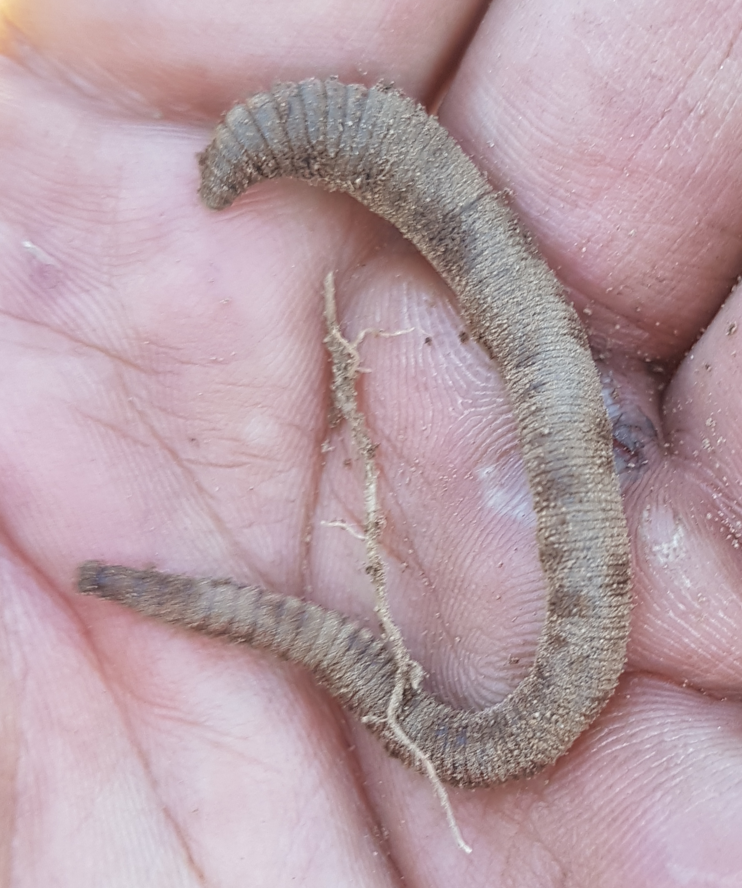
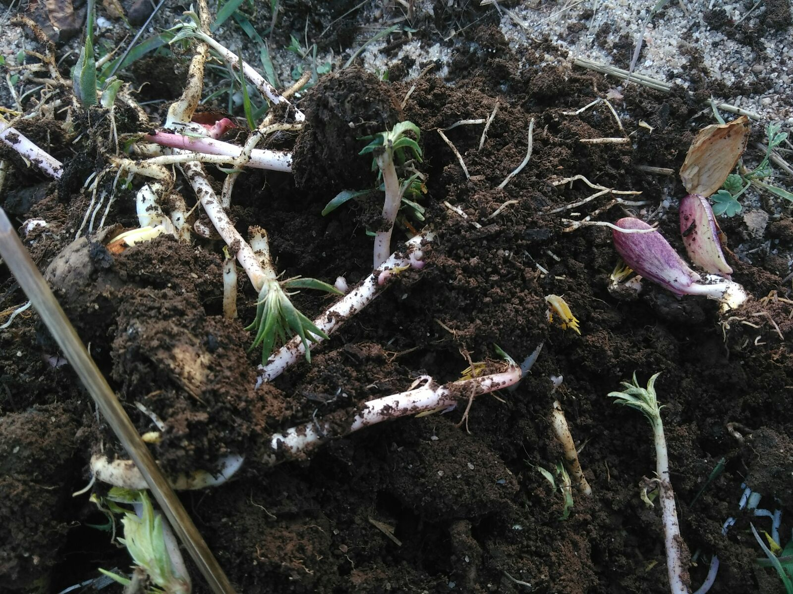

# Tree nurse Nils

{.narrow width="1920" height="2944"}

Nils Zahn is the name of the well-built German holding Laurelin's hand. Do you see the muscle on him? All that bulk is itching to move. And, soonish after this photo, he _did_ move … a whole lot of soil, to dig out nice, soft beds for his tree nursery. I should say that the tree nursery is not just _his_; but _he_ is the most caring tree nurse their tree seeds and seedlings could ever wish for.

The tree nursery was the first project in which I was drafted the day after Marilisa and I arrived in the middle of the Portugese dream of the two hobbits on the photo and that other hobbit. As you can see, it was the start of a sunny day, and my dusty IT bones—cold from the Dutch autumn—would soon be warmed by the sun.

To me, the whole concept of a ‘tree nursery’ was foreign. Sure, I understood that, like any other seed, you can put tree seeds in the ground, and, yes, I would grant you that they might grow a bit faster with some more nutrients. They might then even benefit from some protection against predation. But, that's it. That's about as much thought as I ever gave it. “Nursing trees”? Whatever.

But, they—especially Nils—_had_ gone a bit farther than stuffing some seeds in the ground. There was a plan, and it was evolving—changing to meet a constant stream of new information and insights. Insights abound: from permaculture gurus on the Internet to his old mother-out-law.

{.text-width width="4032" height="3024"}
 
Akiva Silver's [Twisted Tree Farm](http://www.twisted-tree.net/) served as Nils his prime inspiration. Akiva Silver was introduced on the <cite>Permaculture Voice</cite> podcast [#063](http://www.permaculturevoices.com/1000s-of-trees-and-half-an-acre-small-scale-nursery-business-with-akiva-silver-pvp063/) in 2014, as a tree nurse who managed to grow thousands of tree on his then 0.5 acre farm ([{style="height: 1em;" title="SoundCloud"}](https://soundcloud.com/permaculturevoices/pvp063-08052014)). In 2016, when the farm had expanded to **ten** thousand trees on hardly more than that same 0.5 acre, Silver was interviewed again for [#127](http://www.permaculturevoices.com/growing-10000-trees-on-acre-expanding-a-small-scale-nursery-business-an-update-with-akiva-silver-pvp127/) of the podcast ([{style="height: 1em;" title="SoundCloud"}](https://soundcloud.com/permaculturevoices/growing-10000-trees-on-acre-expanding-a-small-scale-nursery-business-with-akiva-silver-pvp127)).

<!-- FIXME: It was more Pinus than Eucalytpus. -->

Peculiar about Silver's nursing method is that, after the trees germinate in very dense seeds beds, he keeps the saplings there until they're tall enough to sell, which is usually in as little as a year. This prospect resonated deeply with Nils, at a time when every cell in his German body was already itching to invade the _Eucalyptus_-invested hills around Ponte de Pedra, supported by an army of homegrown, superior tree species.

<?project-insert?>

‘Superior’ means: more yummy. And surely, _Eucalyptus_ smells delicious, but it's not as palatable as the walnuts, the hazelnuts and the almonds that Laurelin crammed into the first nursery bed we finished.

{.text-width width="4032" height="2145"}

Two more beds were dug out of the clay soil; re-filled with a mixture of the original clay, mixed with compost and sand; and covered with a protective hay cover against the sun (which was still intense during that November 13 afternoon). The second (larger) bed was planted with chestnuts, and the third one with acorns.

{.semi-text-width width="3024" height="4032"}

{.semi-text-width width="3024" height="4032"}

The compost had to be bought in bags, because their own compost heaps were still too fresh (and Laurelin's humanure <!-- TODO: Insert link to Laurelin's humanure article. --> heap did not yet exist). Only about 120 liter of compost were added per 7 by 0.5 meter bed. That's not a whole lot of organic matter, especially when contrasted with what Akiva Silver reported about the organic content in his Twisted Tree beds.

## Silver's seed beds are gold, so let's go for silver.

By 2016, when Akiva was interviewed by Diego Footer for the second time, the soil in the Twisted Tree beds had become so loaded with organic matter that weeds would come out, root and all, without the aid of a tool. The mulchy mixture went down deep enough that he mostly sold trees with tap roots only—no fibrous roots—and coated with mycelium. The soil was built up from yearly inputs of compost, wood chips, and, starting that season, a regular sip of compost tea.

> I don’t use soil tests or worry about introducing weed seeds. I just keep on dumping organic matter. Sawdust, leaves, wood chips, cow manure, chicken manure, sand, ashes, hay, weeds, nut shells, grass clippings, urine, more, more, more. This soil is now highly fertile. It is bustling with microorganisms and worms and mycelium. [Akiva Silver, _[Starting a nursery business](http://www.twisted-tree.net/starting-a-Nursery-Business/)_]

{.narrow width="1784" height="2136"}

Nils' nursery is not (yet) a commercial nursery, while Akiva, in 2016, derived his full income from his. Akiva's soil is now “bustling with microorganisms and worms and mycelium”, whereas we found **exactly two** worms while digging the deep trenches for the Portugese seed beds. So, Nils and his companions still have a long way to go to get to the same level of soil productivity. Maybe they can abbreviate the way with some of Akiva's tricks:

* Every year, he adds copious amounts wood chips to the beds.
* The Twisted Tree beds are almost 100% no-till.
    * His first year, he did use a tractor for the initial mixing of the soil, whereas Nils had to resort to his (and mine) maginificant muscles for digging out his nursery beds.
    * The soil is effectively mixed regularly through weeding and by getting the trees out for sale. He uses hand tools for getting the saplings out.
* Comfrey is Akiva's favorite easy-to-multiply fertilizer. (He commercially grows comfrey, and sells it in bundles of 100 root cuttings.)
* In the 2016 growing season, Akiva has started mixing the water with compost tea.

{.narrow width="1600" height="1200"}

None of these tricks are unique to the nursery business. A deep, deeply alive soil is every agroecologist's concern. And I am sure that Nils' will have the support of my mother and sister to keep boosting the organic content of these beds, since Laurelin and I grew up between compost and tree chip heaps. What _is_ special about what Akiva is doing is packing all these thousands of trees so tight together as he does. That may need to be seen to believe, because growing trees seed to seed for a year is **not** part of folksy common sense.

## Tight together

Intuitively, it may be hard to believe that Akiva's trees wouldn't grow harder if given more space, but the numbers are clear: in 2016, Akiva was growing taller trees, closer together than in 2014. He attributes this primarily to him having become even less squeamish about root space requirements, and to the soil having gotten deeper with every year of mulching.

<table class="text-width">
<thead>
<tr>
<td></td>
<th style="text-align: right;" scope="col">2014</th>
<th style="text-align: right;" scope="col">2016</th>
</tr>
</thead>
<tbody>
<tr>
<th style="text-align: left;" scope="row">Nursery area:</th>
<td style="text-align: right;">0.5 acre</td>
<td style="text-align: right;">0.5 acre</td>
</tr>
<tr>
<th style="text-align: left;" scope="row">Number of trees:</th>
<td style="text-align: right;">4000</td>
<td style="text-align: right;">10000</td>
</tr>
<tr>
<th style="text-align: left;" scope="row">Akiva's income provided by his nursery:</th>
<td style="text-align: right;">30–50%</td>
<td style="text-align: right;">100%</td>
</tr>
<tr>
<th style="text-align: left;" scope="row">Within-row spacing:</th>
<td style="text-align: right;">3″</td>
<td style="text-align: right;">…″</td>
</tr>
<tr>
<th style="text-align: left;" scope="row">Beteen-row spacing:</th>
<td style="text-align: right;">10–12″</td>
<td style="text-align: right;">…″</td>
</tr>
<tr>
<th style="text-align: left;" scope="row">Trees in a 4 × 20ft (1.22 × 6m) seedbed:</th>
<td style="text-align: right;">100 chestnuts</td>
<td style="text-align: right;">300 chestnuts</td>
</tr>
<tr>
<th style="text-align: left;" scope="row" rowspan="2">Trees density:</th>
<td style="text-align: right;">1.25 chestnut/ft²</td>
<td style="text-align: right;">3.75 chestnut/ft²</td>
</tr>
<tr>
<td style="text-align: right;">13.66 chestnut/m²</td>
<td style="text-align: right;">40.98 chestnut/m²</td>
</tr>
<tr>
<th style="text-align: left;" scope="row" rowspan="2">Mean height after a year:</th>
<td style="text-align: right;">12–18″</td>
<td style="text-align: right;">36–44″</td>
</tr>
<tr>
<td style="text-align: right;">30–46cm</td>
<td style="text-align: right;">91–110cm</td>
</tr>
<tr>
<th style="text-align: left;" scope="row"><cite>Permaculture Voices</cite> podcast:</th>
<td style="text-align: right;">
[#063](http://www.permaculturevoices.com/1000s-of-trees-and-half-an-acre-small-scale-nursery-business-with-akiva-silver-pvp063/) 
([{style="height: 1em;" title="SoundCloud"}](https://soundcloud.com/permaculturevoices/pvp063-08052014))
</td>
<td style="text-align: right;">
[#127](http://www.permaculturevoices.com/growing-10000-trees-on-acre-expanding-a-small-scale-nursery-business-an-update-with-akiva-silver-pvp127/) ([{style="height: 1em;" title="SoundCloud"}](https://soundcloud.com/permaculturevoices/growing-10000-trees-on-acre-expanding-a-small-scale-nursery-business-with-akiva-silver-pvp127))
</td>
</tr>
</tbody>
<caption>The annual yield of Akiva Silver's Twisted Tree nursery were already impressive when he was interviewed by Diego Footer in July 2014. Two years later—in 2016—the growth he reported was simply mesmerizing.</caption>
</table>

Akiva likes to emphasize that (ignoring the occasional runt) all the shoots look the same in the first year, even if he plants them seed to seed (like Laurelin did the hazelnuts). After a year, he normally sells the (preferably bare-root) saplings, so he's not usually concerned with the competition that starts afterwards. Do note that, at 90+ centimeters, those year-old trees already reach up to his waist, and sometimes all the way up to his chest (110cm)!

No wonder that Akiva's enthusiasm spilled over from the US, across the Atlantic, all the way to Central Portugal, into the head of a young, energetic German: Nils Zahn, 24, alone—with two women—on a remote hillside in rural Portugal. Not a position to envy. It helps that one of those women is my sexy sibling. But then, the other one is his mother-out-law. (Laurelin and he are not married, so I can hardly call Annemarie his “mother-in-law”.) Also, he has vision. And having vision sucks. Especially if you have a lot of visions at the same time, and even more so if these are rather grand. The word ‘overinspired’ springs to mind. So what is wisdom? Can a young dude grow to the size of his visions in such tight quarters?

I like to believe he could. Every now and then, he would need a little outside impetus, which is readily available through the Internet. And then, when all these awesome ideas are running through his head and over each other, out of his lips, that tired, old mother of mine will ask him: “All very nice, but what will you do _now_?”

What he did _then_? He went to listen to Diego Footer interviewing Akiva Silver. He got inspired. They started planning. They bought compost, mesh wire, and we grabbed a shovel.

## The right breadth. The right depth.

With such a beautiful vision for what a tree nursery could be, Nils' challenge was to bring that down to a manageable first step. At which point it's good to remind ourselves that Nils' tree nursing guru's first steps had been far from grandiose. His journey into growing trees started with an apple kernel. He stuffed the kernel's beautiful, black seeds into a pot, waited, saw the seeds sprout, and was hooked. Then, for years, nursing trees remained a hobby. He traded a bit. (He got a lot of meat. Somebody helped him dig his ponds.) And he started online sales informally, via Craigslist.

The choices rushing through Nils' head were many:

* How well should the nursery beds be prepared in this first year?
    * How much compost should they add? How about mulch?
    * Did they have to mix coarser sand into the fine clay?
* How much of the terrace's area should they turn into tree beds?
    * Should they grow just the trees they needed themselves (hundreds, at least), or also for selling?

Meanwhile, I had started shoveling, quite impatiently. I'm not the analysis-paralysis type, more the changing-my-mind-back-and-forth-along-the-way-4-times type. I'm good at starting things badly. The advantage of this is that I can move very fast. The disadvantage is that I get really stuck when analysis _is_ required. But, there was no need to worry about that; that job was assumed by the resident tree nurse.

{.semi-text-width width="3024" height="4032"}

{.semi-text-width width="3024" height="4032"}

The first-year beds we dug weren't as fantastic as Akiva Silver's. He can pull out weeds with big tap roots by hand. Indeed, this is an experience that I can confirm from my nuclear family's mulched flower beds. (Laurelin and I didn't grow up with the idea that ecological horticultural principles can also be applied to (commercial) crop production.) But, I like to think that the beds were exactly the right depth and the right breadth for this first-year experiment. Perhaps even more importantly: the tree beds are in the right place: in the middle of the Portugese property where the trees will have to grow, not all the way across the Atlantic, in New York.

## Small-scale. Biome-specific.

Akiva grows his tree in a pretty cold climate. The winters in upstate New York (USA) are long, the growing season short. There's around-the-year precipitation. Central Portugal is much dryer. Last summer's hot drought extended into the end of November, and many of the Iberian _Eucalyptus_ forests burned down in massive June and October forest fires. A chestnut genotype that does well in cold, wet Spencer, NY is likely a different genotype from one that does well in Portugal.

<table class="text-width">
<thead>
<tr>
<td></td>
<th style="text-align: right;" scope="col">Spencer, NY, USA</th>
<th style="text-align: right;" scope="col">Ponte de Pedra, PRT</th>
</tr>
</thead>
<tbody>
<tr>
<th style="text-align: left;" scope="row">Elevation:</th>
<td style="text-align: right;">389m</td>
<td style="text-align: right;">330m</td>
</tr>
<tr>
<th style="text-align: left;" scope="row">Inclination:</th>
<td style="text-align: right;">sloped</td>
<td style="text-align: right;">sloped</td>
</tr>
<tr>
<th style="text-align: left;" scope="row">Annual precipation:</th>
<td style="text-align: right;">“a lot”</td>
<td style="text-align: right;">400–1200mm</td>
</tr>
<tr>
<th style="text-align: left;" scope="row">Rain frequency:</th>
<td style="text-align: right;">“at least weakly”</td>
<td style="text-align: right;">very dry summers</td>
</tr>
<tr>
<th style="text-align: left;" scope="row">Growing season:</th>
<td style="text-align: right;">May–September</td>
<td style="text-align: right;">March–November</td>
</tr>
<tr>
<th style="text-align: left;" scope="row">Min. temparature:</th>
<td style="text-align: right;">-15°C</td>
<td style="text-align: right;">-5°C</td>
</tr>
<tr>
<th style="text-align: left;" scope="row">Max. temparature:</th>
<td style="text-align: right;">…°C</td>
<td style="text-align: right;">40+°C</td>
</tr>
<tr>
<th style="text-align: left;" scope="row">Mean temparature:</th>
<td style="text-align: right;">…°C</td>
<td style="text-align: right;">8–24°C</td>
</tr>
</tbody>
<caption>The growing conditions between Ponte de Pedra and upstate New York differ markedly, which is precisely the point of why small-scale, biome-specific tree nurseries are so important.</caption>
</table>

As a total chestnut fanatic, Akiva has the remarkable luck of living at the same road as somebody who has spent 40+ years selecting chestnut variates from around the world for blight and cold resistance.

The chestnuts in Nils' tree nursery all come from the local market in Cernache do Bonhardim and the acorns were gathered in various local forests. That's plenty of biome-specificity for now. Then, when later this month (March, 2018), we will be clearing the charred (but already regenerating) _Eucalyptus_ trees from their hillside, there will be plenty of space to experiment with and select for which varieties of chestnut, oak, walnut, hazelnut, and almond do best in a dry, warm environment. And last, but not least, there will be tons of delicious-smelling _Eucalyptus_ wood chips with which the nursery's bed can be made so much looser and softer.

