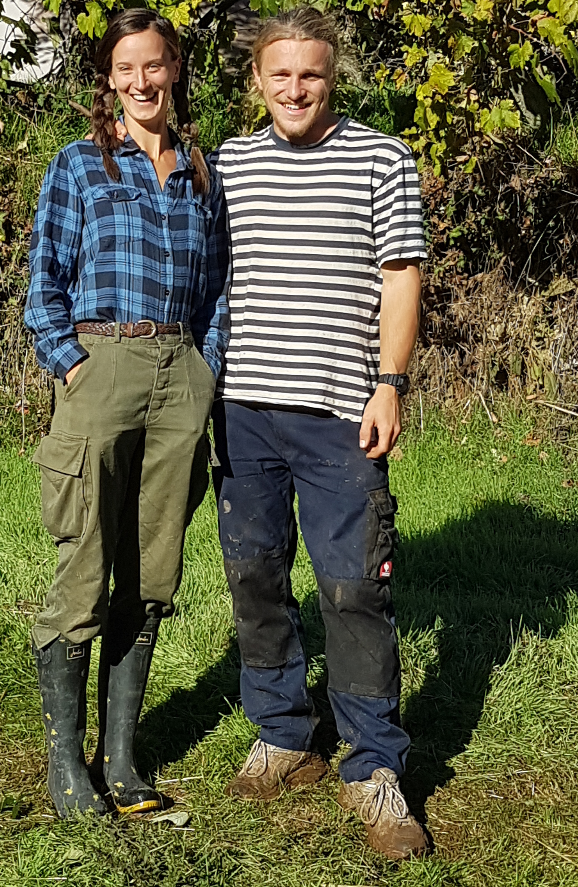

# Tree nurse Nils

{.narrow width="1920" height="2944"}

Nils Zahn is the name of the well-built German holding Laurelin's hand. Do you see the muscle on him? All that bulk is itching to move. And, soonish after this photo, he _did_ move … a whole lot of soil, to dig out nice, soft beds for his tree nursery. I should say that the tree nursery is not just _his_; but _he_ is the most caring tree nurse their tree seeds and seedlings could ever wish for.

The tree nursery was the first project in which I was drafted the day after Marilisa and I arrived in the middle of the Portugese dream of the two hobbits on the photo, and that other hobbit. As you can see, it was the start of a sunny day, and my dusty IT bones—cold from the Dutch autumn—would soon be warmed by the sun.

## To nurse or not to Nils

To me, the whole concept of a ‘tree nursery’ was foreign. Sure, I understood that, like any other seed, you can put tree seeds in the ground, and, yes, I would grant you that they might grow a bit faster with some more nutrients. They might then even benefit from some protection against predation. But, that's it. That's about as much thought as I ever gave it. “Nursing trees”? Whatever.

But, they—especially Nils—_had_ gone a bit farther than stuffing some seeds in the ground. There was a plan, and it was evolving—changing to meet a constant stream of new information and insights. Insights abound: from permaculture gurus on the Internet to his old mother-out-law.

{.text-width width="4032" height="3024"}
 
Akiva Silver's [Twisted Tree Farm](http://www.twisted-tree.net/) served as Nils his prime inspiration. Akiva Silver was introduced on the <cite>Permaculture Voice</cite> podcast [#063](http://www.permaculturevoices.com/1000s-of-trees-and-half-an-acre-small-scale-nursery-business-with-akiva-silver-pvp063/) in 2014, as a tree nurse who managed to grow thousands of tree on his then 0.5 acre farm ([{style="height: 1em;" title="SoundCloud"}](https://soundcloud.com/permaculturevoices/pvp063-08052014)). In 2016, when the farm had expanded to a full acre and **ten** thousand trees, Silver was interviewed again for [#127](http://www.permaculturevoices.com/growing-10000-trees-on-acre-expanding-a-small-scale-nursery-business-an-update-with-akiva-silver-pvp127/) of the podcast ([{style="height: 1em;" title="SoundCloud"}](https://soundcloud.com/permaculturevoices/growing-10000-trees-on-acre-expanding-a-small-scale-nursery-business-with-akiva-silver-pvp127)).

Peculiar about Silver's nursing method is that, after the trees germinate in very dense seeds beds, he keeps the saplings there until they're tall enough to sell, which is usually in as little as a year. This prospect resonated deeply with Nils, at a time when every cell in his German body was already itching to invade the _Eucalyptus_-invested hills around Ponte de Pedra, supported by an army of homegrown, superior tree species.

<?project-insert?>

Laurelin inserted a:

{.text-width width="4032" height="2145"}

dfdfdf
