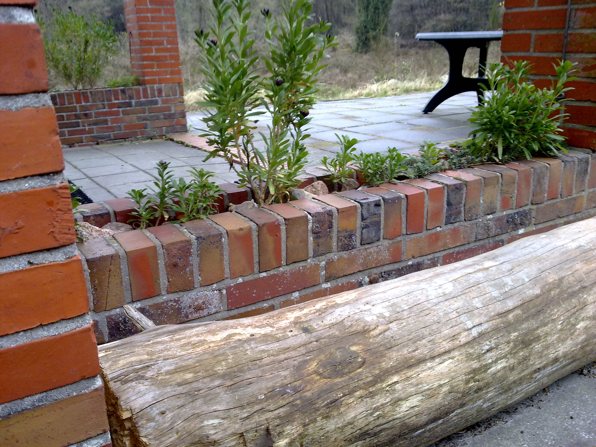
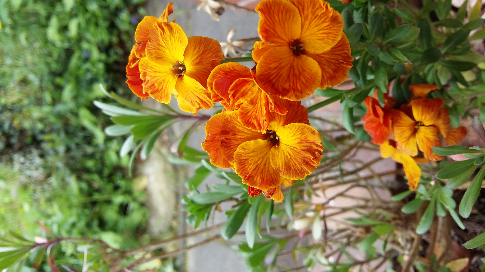
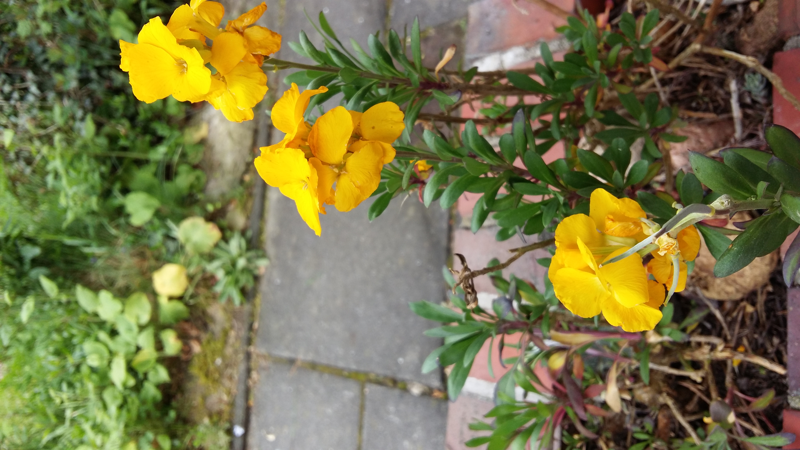

# A wallflower refuge

Two little brick walls extend from the “De Schuilplaats” its living room onto the south terrace. The low walls both end in thick pillars that supports the roof. This creates an overhang. And below the terrace tiles there's a foundation, which was at some point meant to support a possible extension to the living room. However, the walls ended up just being empty temporary plant pots; occassionally, somebody some blown in seed would germinate into a more or less full-grown plant until it withered away again, usually before the end of the growing season. At other times, a brave soul would plant something—a succulent, if they were smart. But, even succulents would usually whither and dry out. The problem: the overhanging roof keeps most of the rain away from these oblongue ‘pots’. As Bill Mollison would say, “the problem [was] the solution”. 

The ‘pot space’ between the ‘outer’ and ‘inner’ brick layers was too dry even for most succulents, but not for a flower with the most appropriate name: the wallflower (_Erysimum cheiri_).

I got a few specimen from my mother, who, at the time, had an allotment garden where little wallflower seedlings sprung up everywhere. That was also the first place were I ever encountered them and were I instantly fell in love with their colorful variety.

Trying out different things

Propagule pressure

<!-- vim: set wrap linebreak nolist textwidth=0 wrapmargin=0 formatoptions-=t : -->
