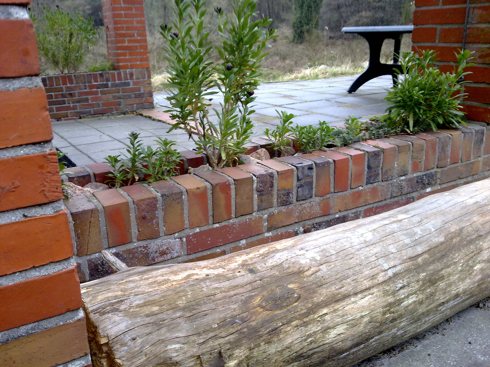
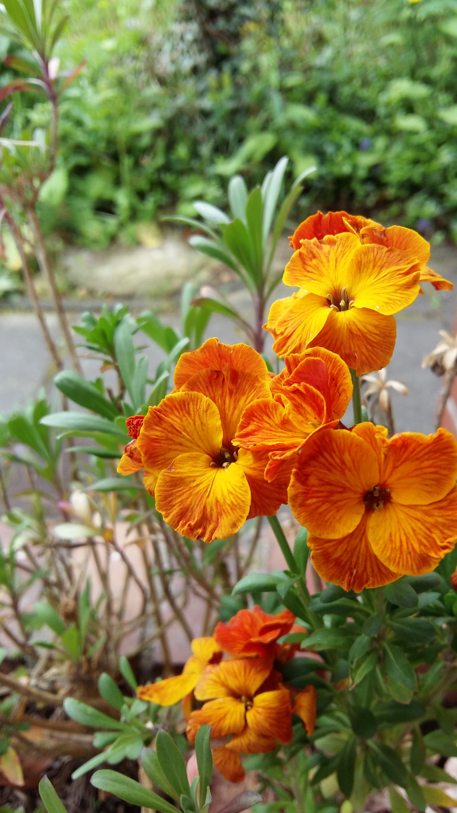
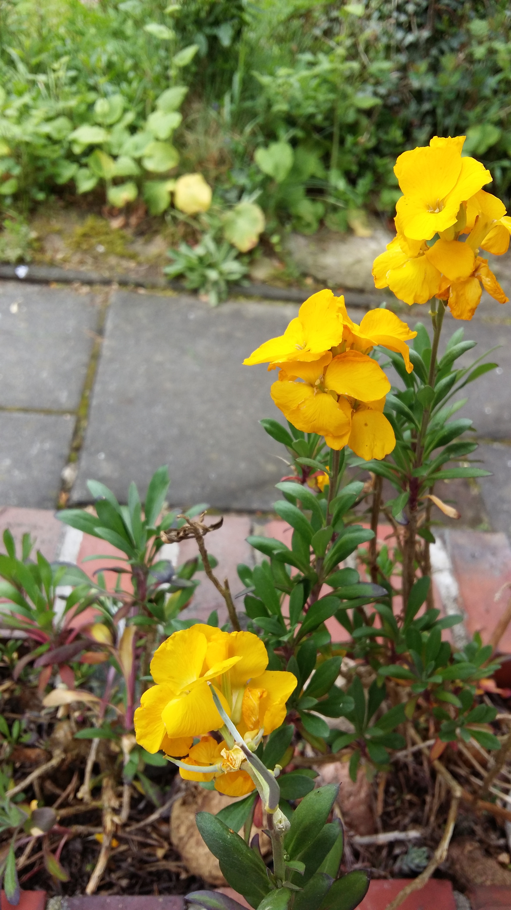
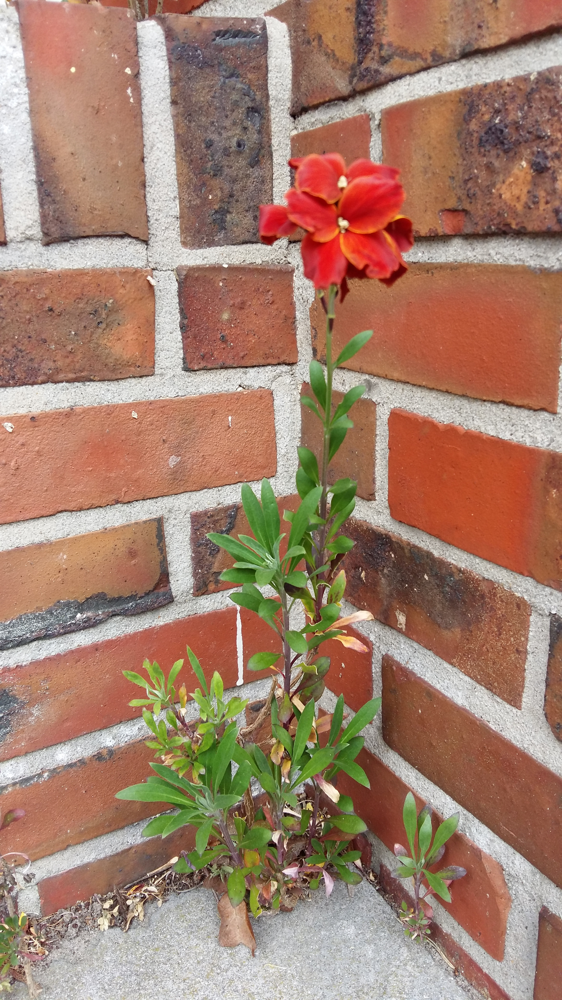

# A wallflower refuge

Two little brick walls extend from the “De Schuilplaats” its living room onto the south terrace. The low walls both end in thick pillars that supports the roof. This creates an overhang. And below the terrace tiles there's a foundation, which was at some point meant to support a possible extension to the living room. However, the walls ended up just being empty temporary plant pots; occassionally, some blown in seed would germinate into a more or less full-grown plant until it withered away again, usually before the end of the growing season. At other times, a brave soul would plant something—a succulent, if they were smart. But, even succulents would whither and dry out. The problem: the overhanging roof keeps most of the rain away from these oblongue ‘pots’. And, as Bill Mollison would say, “the problem [was] the solution”. 

{.text-width width="2592" height="1944"}

The ‘pot space’ between the ‘outer’ and ‘inner’ brick layers was too dry even for most succulents, but not for a flower with the most appropriate name: the wallflower (_Erysimum cheiri_).

I got a few specimen from my mother, who, at the time, had an allotment garden where little wallflower seedlings sprung up everywhere. That was also the first place were I ever encountered them and were I instantly fell in love with their colorful variety.

{.semi-text-width width="2322" height="4128"}

{.semi-text-width width="2322" height="4128"}

## Propagule pressure

The little seedling which ended up establishing their own wallflower lineage at “De Schuilplaats” were not the first of my wallflower transplantation experiments. Prior to this 2011 expirement, I tried establishing a wall flower transplantation in my father's garden in Eelde, both seeds as well as seedlings. Only one pair of seedlings took hold there for a while, until my father's Ecuadorian father in law mistook it for a weed. (Only recently did I start to think about the particular places in which these two seedlings survived for a while, but more about habitat selection later…)

Not at “De Schuilplaats”. After a difficult start, during which some of the propagule dried out dispite the occassional watering, the wallflowers in the walls started thriving, no longer requiring any care. Encouraged, I planted some more seedlings and sowed a few handfulls of seeds. Then, after as little as one growing season, the biggest flowering speciment sported its own seeds.

.jpg){.text-width width="2592" height="1944"}

But, also at “De Schuilplaats”, I had previously tried sowing seeds, none of which germinated. So there has already been some _Propagule pressure_ before I successfully transplanted some seedlings, but apparently not sufficiently so to result in the successful establishment of this locally foreign species. (The Romans probably already introduced wallflowers to The Netherlands some 2000 years ago.)

## Habitat selection

The reason that the wallflower seedlings that I transplanted into the low walls were the first to thrive at “De Schuilplaats” was non-obvious to me at first, although I could have deduced it from the plant name: _wall_-flower. Wallflower like to grow in walls. Specifically, they like walls with high calcium contents in the mortel. (The kind of walls they like have, in fact become scarce in The Netherlands, which has earned the plant a place on the red list of endangered plant species, and it is also on the list of lawfully protected plant species, meaning that, if someone was to do some construction work on these wallflower-infested walls, they'd have to take measures to protect these wallflowers.)

{.semi-text-width width="2322" height="4128"}

{.semi-text-width width="2322" height="4128"}

From the two low walls, the wallflowers seeds have spread over the adjacent terrace. The only seeds that germinate outside of the wall, though, do so on the wall-terrace interface. That's how much they require the calcium that seeps from the cement that holds the brick walls together.

## Inspiration for wallflowers

I've been accused of being a wallflower myself. Since I've become familiar with the scent, the colors, the long flowering season and the fortitude of _Erysimum cheiri_, it's hard to take this as an insult. What becomes of the following memory when I identify with this flower?

> At a friend's wedding, another friend's wife offered to introduce me to one of the bride's nieces, who happened to be a student of the other friend's wife—a professor. She pulled me away to tell me: “Don't be a wallflower.” At the time, I was slightly—not terribly—offended. The wife/professor didn't know was that I had already talked to her student—the bride's niece—and was simply not interested. At the end of their own wedding I had actually asked one of their caterers out on a date (unsuccessfully).

What if I _were_ a wallflower? That would be good. All it would mean is that I knew I wouldn't be able to make more of myself in the wrong habitat. Wallflowers need a wall, not too much water and some sun. In fact, the friend's professor wife is a wallflower as well. She tried lots of different habitats, none of which allowed her to thrive, before settling with my calcium-rich friend. And, in the end, I too found a wall that was soft enough and not too static. My roots immediately took to the cement and I could finally thrive.

{.text-width width="4128" height="2322"}

<!-- vim: set wrap linebreak nolist textwidth=0 wrapmargin=0 formatoptions-=t : -->
